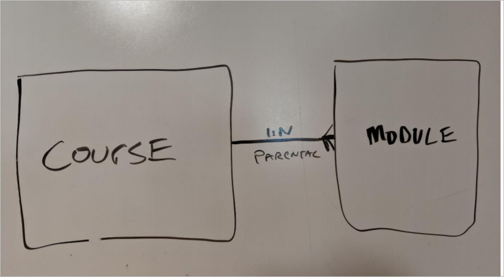
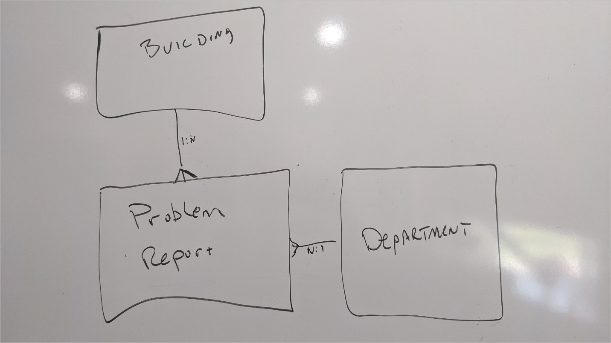
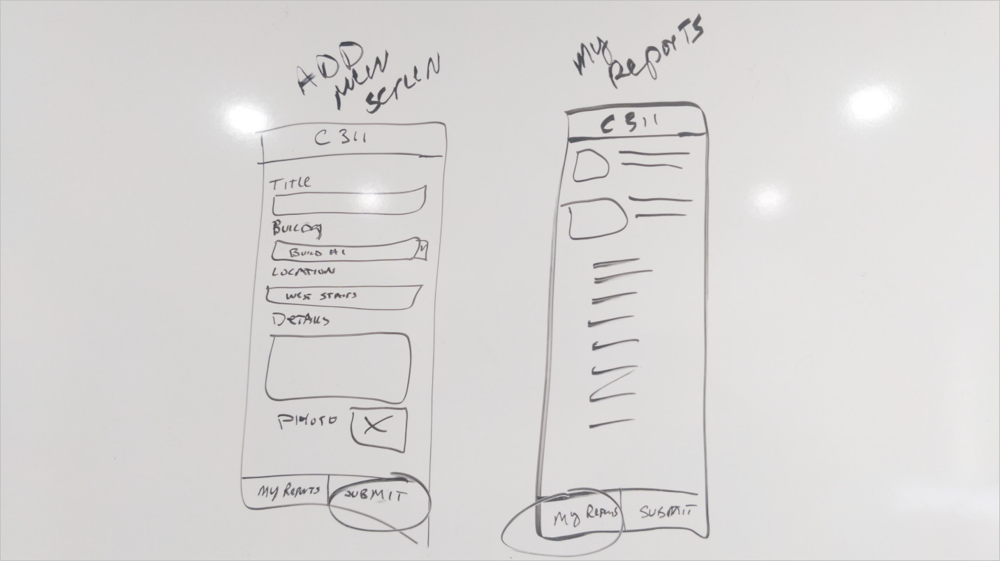

# Lab 01: Design the solution

In this lab you will be shaping your idea into something that can be implemented on the Power Platform.   As part of this you will meet with other people in your organization to get more clarity on how your idea could be implemented.  Using this information, you will identify what applications and automations need to be built.

## What you will learn

  - How to identify gaps and requirements for an idea

  - How to map a problem domain to the Power Platform 

  - How to determine required entities for a data model 

## High-level lab steps

  - Exercise 1 - Scenario overview 

  - Exercise 2 - Extract needs from interview with a co-worker and facility staff

  - Exercise 3 - Design a data model

  - Exercise 4 - Identify apps and automation that are needed 

  - Exercise 5 - User story, mockup the app UI 

## Detailed steps

### Exercise 1: Scenario Overview

In this exercise, you will get up to speed on the scenario you will be building in this series of labs.

#### Task 1: Read the scenario

Read the following scenario and make note of any key points you think might be important later.

> You are an employee at Lamna Healthcare Company and work in the billing department.
> 
> As you were walking out to your car from work you noticed the company digital sign by the exit was still welcoming participants of the 2019 convention.  You would tell someone, but you have no idea who to tell.  So often you find something in your company that should be fixed but have no way to tell anyone. 
> 
> As you were driving home sitting in traffic you had an idea. What if there was an app you could use to report things like this?  You could report a location, a category and even a picture of the problem so someone could easily locate and fix it.  The only problem was if you got people to report things who would be listening?
> 
> The next day at work you met with your friend in the facility department and shared your idea.  She was excited too because today there is no coordinated way she can get problems like these reported and fixed. She explained how often they involve different departments and must be routed and followed up to find out the status.  She had looked at commercial options, but they had been too complex and inflexible, overengineered, and expensive. She did however give you an example of a 311-system used by cities for their citizens to report problems.  Based on that example, you decided you would call it Company 311.

### Exercise 2: Extract needs from interviews

In this exercise, you review the text from an interview you had with a couple of colleagues. In each of these interviews you shared your idea for a Company 311 solution and got feedback from your coworkers. You should use this information to shape the solution design.

#### **Task 1: Interview \#1**

Review the following discussion with your coworker and take notes of any of the key things you learned from the interaction. This Interview is from a coworker in your same Department that you are friends with.

> **You**:   I wanted to get your thoughts on the idea for a Company 311 that we talked about.  I am thinking of starting to build that app. What do you think we need to include when we submit a problem report?
> 
> **Coworker**: Well you have to capture where the problem is - we have so many buildings.  What department should fix it.   Oh, and a picture. 
> 
> **You**:   Do you think building is enough to identify where the problem is? 
> 
> **Coworker**:   Maybe allow them to describe where in the building... 
> 
> **You**:  After you report a problem what do you expect to happen? 
> 
> **Coworker**:  Them to fix it of course\!  
> 
> **You**: No, I mean in the app, what do you see after you click submit problem? 
> 
> **Coworker**: I want to know that someone got it and it’s being worked on and when fixed. Actually, not always but most of the time...maybe let me choose to be notified? 
> 
> **You**: So perhaps a list of all your items submitted? 
> 
> **Coworker**: Yeah that would be great\! 
> 
> **You**: perfect, I will let you know when you can try the app\! 

After you complete reading this and have your notes compare them to our notes in the next task to see if you missed anything.

#### **Task 2: Interview \#1 Notes**

In this task, you will compare your notes from Interview \#1 with our notes.

The following are our notes from Interview \#1

  - Need to be able to pick a building for each problem

  - Need to capture which department needs to fix it when you submit the problem

  - Need a photo of the problem

  - Need a freeform text description of the problem location within the building

  - Need a way to indicate if you want to be notified when completed

  - Need to see all the problems you submitted and their status

#### **Task 3: Interview \#2**

Review the following discussion with your coworker and take notes of any of the key things you learned from the interaction. This Interview is from a coworker in facilities management that you are friends with. You believe most of the problem reports will be handled by them.

> **You**: I wanted to get your thoughts on the idea for a Company 311 that we talked about. I am thinking of starting to build that app. What do you think needs to be included when people submit a problem report?
> 
> **Coworker**: As much details as possible, a photo would be nice. Oftentimes we get reports that are just a very vague indication of the problem that if we had a picture it would be 1000 times clearer.
> 
> **You**: What do you think about allowing them to pick which department they think will fix the problem?
> 
> **Coworker**: Now that is funny\! Most people have no idea who fixes it and think it is just magic. I would suggest that people just submit the problem report without a department and then one of our facilities people would assign the department it needs to address the problem.
> 
> **You**: Perfect\! Do you fix all the problems that get reported?
> 
> **Coworker**: Many of them some are duplicates and do not get fixed; others will cost too much and must get manager approval and if they are not approved then they don't get fixed.
> 
> **You**: How do you do that approval today?
> 
> **Coworker**: Well if I get one that I think is going to be expensive I have to try to track down the manager for approval, and sometimes if I can’t get it right away it gets set aside till I remember.
> 
> **You**: Ok, so if we could include approval that might help. I will let you know when you can try the app\!

After you complete reading this and have your notes compare them to our notes in the next task to see if you missed anything.

#### **Task 4: Interview \#2 Notes**

In this task, you will compare your notes from Interview \#2 with our notes.

The following are our notes from Interview \#2

  - Having a photo would be helpful

  - Department should not be provided by user but assigned after submitting

  - Approval required over specific amount, would be helpful to automate

### **Exercise 3: Design a data model**

In this exercise, you will create the data model to support the apps you will be building.

#### **Task 1: Evaluate what you know already about the data**

In this task, you will be evaluating the information you already collected about your proposed solution and trying to identify what data entities are needed and how they are related. If you want, you can do this task concurrently with the next task where you draw the data model.

1.  Identify the main data that will be managed by the solution. This will typically become one or two entities and will be the focus of the app you build. Other data is typically related to and supports these entities.

2.  Identify related entities needed to support your scenario.

3.  Identify how entities should be connected using relationships.

4.  Evaluate what should be fields and what should be entities. For example, how should the photo be stored or the location within the building?

#### **Task 2: Draw a draft data model**

Use whatever tools you have available; you can use a whiteboard, Visio, PowerPoint, OneNote, or you can even use it piece of paper and pen. The goal here is not to be picture perfect but to allow you to think through what the data model should look like and possibly share with others and get their ideas. This data model typically will be your guide when you are creating the entities in the maker portal. Well you could of course just start creating the entities in the portal by creating a diagram helps ensure it's a little bit more well thought out.

1.  Draw your data model, including relationships and any relationship behaviors. Your drawing should look like the following example, except yours should be for your Company 311 solution.
    
    

2.  After you complete your drawing proceed to the next task.

#### **Task 3: Compare data models**

In this task, you will compare the data model you created in the previous task with the one we prepared. If there are significant differences you should discuss those with your instructor.

### **Exercise 4: Identify apps and automation needed**

In this exercise, you will be looking at the information you collected and deciding what apps and automation is required to implement the solution. The goal is not to identify every feature of the application or automation but to identify do you need one app or ten apps and what style app are they.

#### **Task 1: Evaluate what apps are needed**

In this task you are going to look at how the users interact with the applications and decide if you need one or multiple applications and what style they're going to be, i.e. canvas or model-driven. There is no single right answer to how to accomplish this, but by asking the right questions you can lead down a path of getting a better solution for your users. As you go through the following steps make some notes that is applicable for your Company 311 solution.

1.  Identify who will be using the app.

2.  For each set of users will they be accessing it mostly from for mobile device or desktop?

3.  Of the overall functionality you are going to provide are there specific subsets that some users use all the time?

4.  Is there any device usage that would lend itself to one type of application versus another?

5.  Is any of the functionality more data management that would lend itself more to a model-driven app?

6.  Considering your answers to the above questions make notes of how many apps you will be building, the type of app, and what each app will do and how it will be used by.

7.  After you complete these continue to the next task to compare notes.

#### **Task 2: Compare your notes on apps**

In this task, you should compare your notes from the previous task with our prepared notes. If there are big differences you should discuss them with your instructor.

1.  Identify who will be using the app:
    
      - Group 1 – Any employee in the company
    
      - Group 2 - Facilities staff and anyone in the different departments that fix problems

2.  For each set of users will they be accessing it mostly from for mobile device or desktop?
    
      - Group 1 – Probably mostly on their mobile devices
    
      - Group 2 - Mostly on their desktop but sometimes on mobile

3.  Of the overall functionality you are going to provide are there specific subsets that some users use all the time?
    
      - Group 1 – Most important functionality is submitting a problem report, they do not do anything to manage the list of buildings or departments
    
      - Group 2 - Most important functionality is routing and resolving problem reports and managing the reference data associated with buildings and apartments

4.  Is there any device usage that would lend itself to one type of application versus another?
    
      - Easy use of camera or photo upload from mobile device

5.  Is any of the functionality more data management that would lend itself more to a model-driven app?
    
      - The management of reference data for buildings and apartments would be easy to do in a model driven app.
    
      - The routing and assignment of problem reports to different users would be easy to handle in a model driven app.

6.  Considering your answers to the above questions make notes of how many apps you will be building, the type of app, and what each app will do and how it will be used by.
    
      - App 1 – Company 311 - This will be a canvas application used to submit new problem reports and see a list of any problem reports submitted.
    
      - App 2 – Company 311 Admin - This will be a model driven application used by all those that route and resolve problem reports. this application will also manage all the reference data like buildings and department lists.

### **Exercise 5: User story, app UI mockup**

In this exercise, you will review a user story that describes a user interacting with the app to submit a problem report.

#### **Task 1: User Story**

Review the following user story:

> As a user I want to be able to quickly open the app and submit a problem report. I should be able to pick a building, give a location that describes where the problem is. The app should allow me to provide one line title and details of the problem. I should be able to optionally provide a photo. I should be able to easily switch over and see the list of problems that I already submitted and their status.

1.  Using any of the tools you have available, such as a whiteboard, Visio, OneNote or even a piece of paper and a pen, draw a mockup of the user interface to satisfy the above user story.

2.  After you have completed your drawing of the mockup go ahead to the next task and compare it to the one we provide.

#### **Task 2: Compare mockup**

The following is an example UI mockup showing both the add new item an My reports list. There is no single answer to what this has to look like and there are possibly many examples you could come up with. The goal for UI markup is to be able to quickly demonstrate what you want to build and show it to somebody and without having to actually build it. Depending on the tool you used you can often make changes quickly as you evolve the mockup. The markup is used to help you build the actual applications screens quicker with less rework.

