# **Lab 02 – Data model and model-driven app**

In this lab you will be implementing the data model for the solution and building a model-driven app that will be used by anyone fixing problems or managing the overall effort.

## **What you will learn**

  - Create entities, fields, and relationships

  - Create model-driven app

  - Create a site map

  - Create and configure entity forms

  - Create and configure entity views

## **High-level lab steps**

  - Exercise 1 – Create publisher and solution  

  - Exercise 2 – Implement the data model 
    
      - Data Model 
        
          - Building 
          
          - Department 
          
          - Problem Report 

  - Exercise 3 – Configure forms and views 

  - Exercise 4 – Compose a basic model-driven app 

  - Exercise 5 – Input data and refine some views, import some problem reports 

## **Detailed steps**

### **Exercise 1: Create publisher and solution**

In this exercise, you will create a custom solution publisher and a solution. This custom solution will be used in all the labs for this course to keep all the assets together.

#### **Task 1: Create publisher and solution**

1.  Navigate to the [Power Apps maker portal](https://make.powerapps.com/) and make sure you are in the correct environment assigned to you.

2.  Select **Solutions** and click **+ New solution**.

3.  Enter **Company 311** for **Display name**.

4.  Click on the **Publisher** dropdown and select **+ Publisher**.

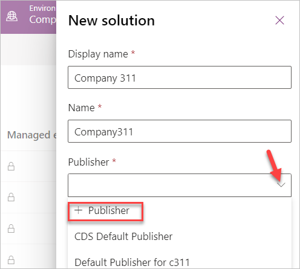

5.  Enter **Lamna Healthcare** for **Display name**, **lh** for **Prefix**, and click **Save and Close**.

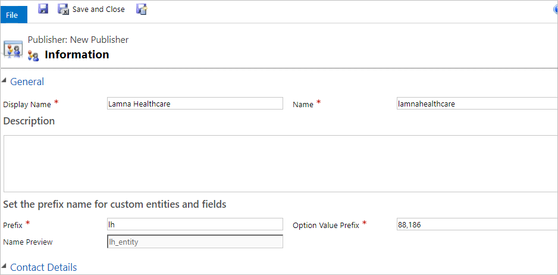

6.  Click **Done** on the popup.

7.  Click on the **Publisher** dropdown again and select the **Lamna Healthcare** publisher you created.

8.  Click **Create**.

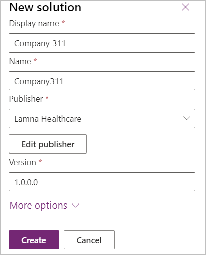

9.  You should now see the solution you crated in the solution list.

### **Exercise 2: Implement data model**

In this exercise, you will create entities, fields, and the relationships you identified when you designed the data model for the Company 311 app.

#### **Task 1: Create entities**

1.  In the [Power Apps maker portal](https://make.powerapps.com/) select **Solutions** and click to open the **Company 311** solution you created in Exercise 1.

2.  Click **+ New** and select **Entity**.

3.  Enter **Building** for **Display name** and click **Done**.

4.  Go back to the solution by clicking on the solution name.

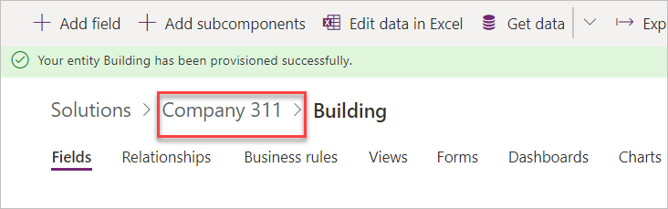

5.  Click **+ New** and select **Entity** again.

6.  Enter **Department** for **Display name** and click **Done**.

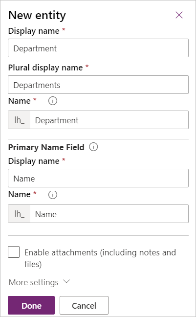

7.  Go back to the solution by clicking on the solution name.

8.  Click **+ New** and select **Entity** one more time.

9.  Enter **Problem Report** for **Display name**, change the **Primary field** **Display name** to **Title**, and click **More settings**.

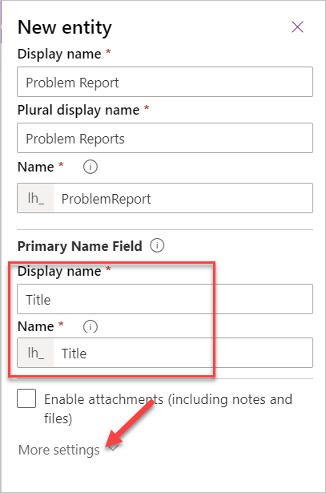

10. Click to expand the **Collaboration** section.

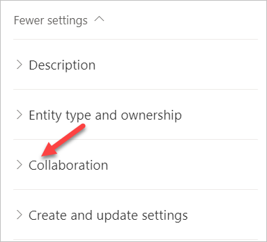

11. Check the **Enable queues** checkbox and click **Done**. Enabling queues allows Problem Report records to be associated with one or more queues to help facilitate routing to the different departments.

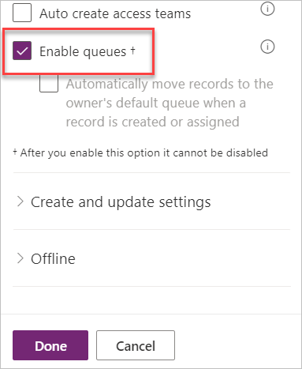

12. Click **Okay** on the **Confirm changes** popup.

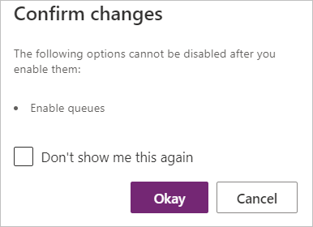

#### **Task 2: Add fields**

In this task, you will add fields to the Problem Report entity.

1.  Navigate to the [Power Apps maker portal](https://make.powerapps.com/) page and make sure you are in the correct environment.

2.  Select **Solutions** and click to open the **Company 311** solution you created in exercise 1.

3.  Locate and click to open the **Problem Report** entity.

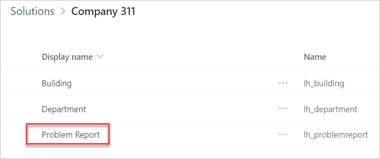

4.  Select the **Fields** tab and click **+ Add field**.

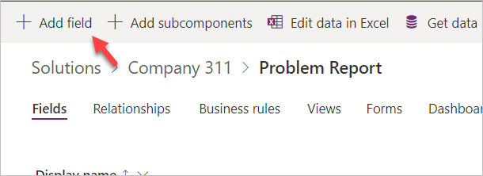

5.  Enter **Location** for **Display name**, select **Text** for **Data type**, and click **Advanced options**.

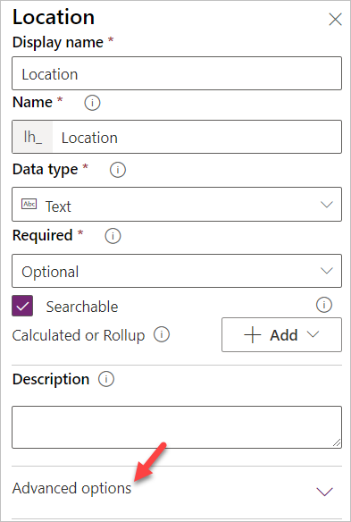

6.  Change **Max length** to **150** and click **Done**.

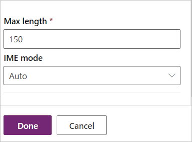

7.  Click **+ Add field** again.

8.  Enter **Details** for **Display name**, select **Multiline text** for **Data type**, make the field **Required**, and click **Done**.

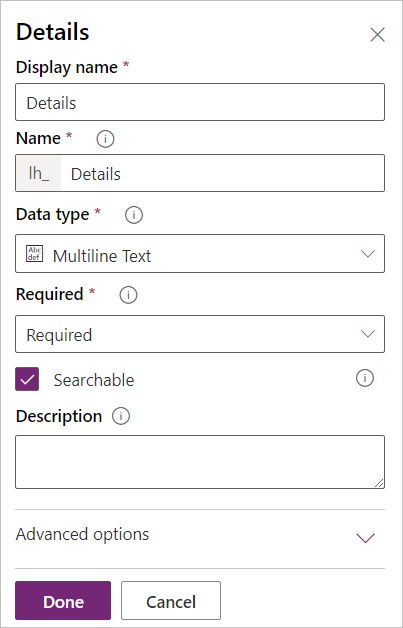

9.  Click **+ Add field** again.

10. Enter **Photo** for **Display name**, select **Image** for **Data type**, and click **Done**.

11. Click **+ Add field**.

12. Enter **Resolution** for **Display name**, select **Multiline text** for **Data type**, and click **Done**.

13. Click **+ Add field**.

14. Enter **Resolved On** for **Display name**, select **Date and time** for **Data type**, and click **Done**.

15. Click Filter and select Custom

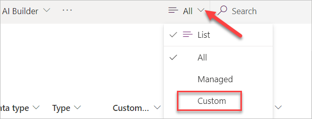

16. You should now see the 5 new fields you created. Click **Save entity**.

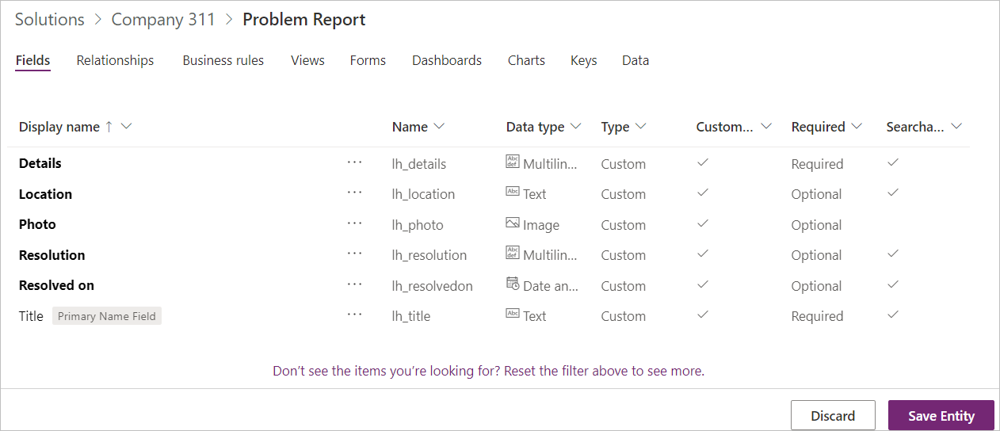

17. Go back to the solution by clicking on the solution name.

18. Click **Publish all customizations** and wait for the publishing to complete.

19. Do not navigate away from this page.

#### **Task 3: Edit status reason option set**

In this task, you will edit the status reason field of the problem report entity.

1.  Make sure you are in the **Company 311** solution.

2.  Click to open the **Problem Report** entity.

3.  Click on the **… More commands** button and select **Switch to classic**.

> \[\!NOTE\]  
> You are switching to classic because the modern solution explorer does not support editing status reason yet but will in the future.

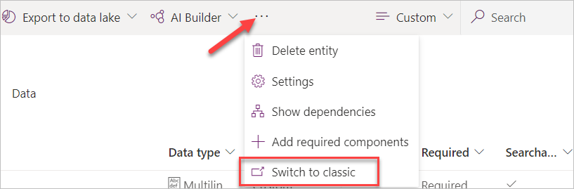

4.  Select **Fields** and double click to open the **Status Reason** field.

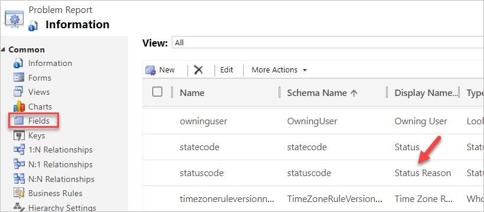

5.  Make sure **Active** is selected for **Status** and double click to open the **Active** option.

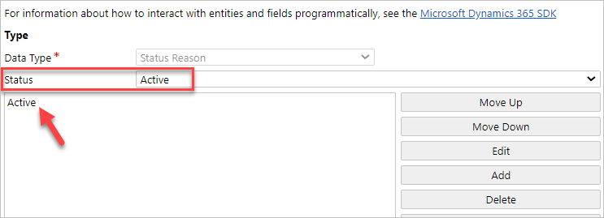

6.  Change the **Label** value to **New** and click **OK**.

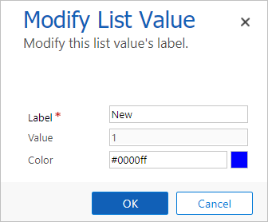

7.  Click **Add**.

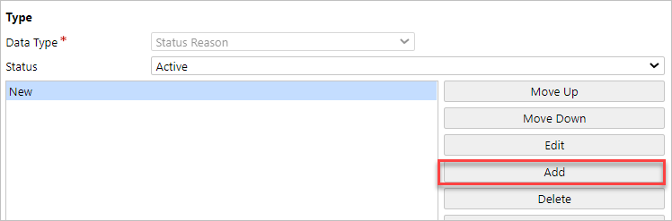

8.  Enter Assigned for Label and click OK.

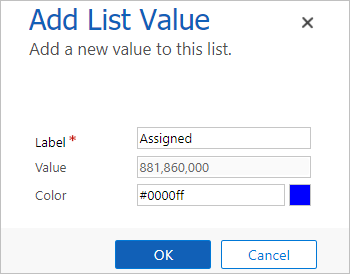

9.  Click **Add** again.

10. Enter **In Progress** for **Label** and click **OK**.

11. Click **Add** again.

12. Enter **Completed** for **Label** and click **OK**.

13. Click **Add** one more time.

14. Enter **Won’t Fix** for **Label** and click **OK**.

15. You should now have 5 options. Select **New** for **Default Value** and click **Save and Close**.

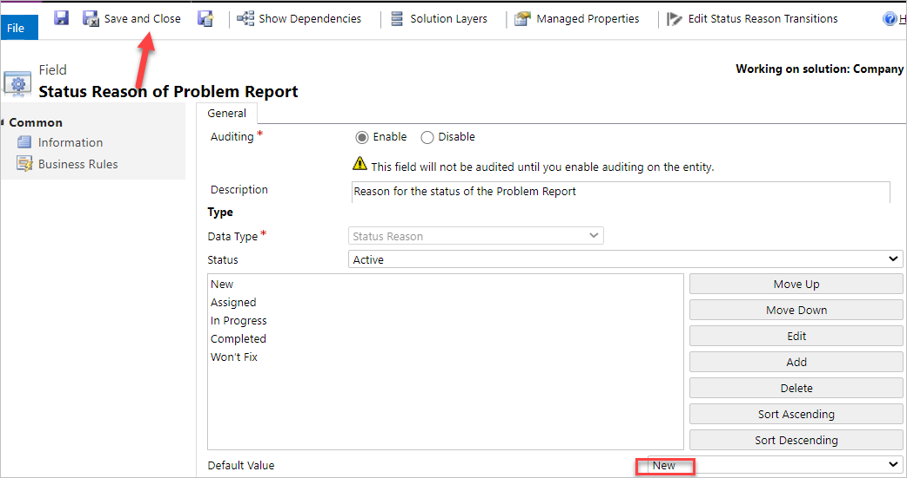

16. Click **Publish** and wait for the publishing to complete.

17. Click Save and Close to close the classic editor.

18. You should now be back on the **Power Apps Maker** portal.

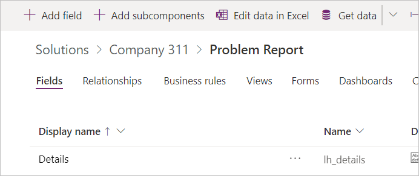

19. Do not navigate away from this page.

#### **Task 4: Relationships**

In this task, you will create many to one relationships between the problem report entity and the building and department entities.

1.  Make sure you are in the **Problem Report** entity.

2.  Select the **Relationships** tab and click **+ Add relationship**.

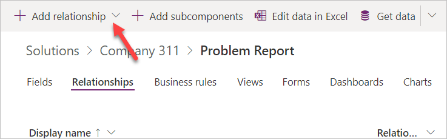

3.  Select **Many-to-one**.

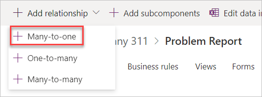

4.  Select **Building** for **Related (One) Entity** and click **Done**.

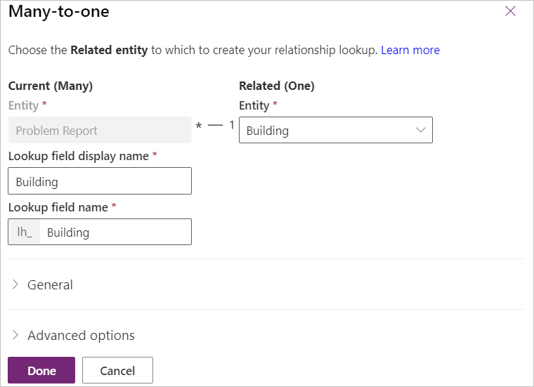

5.  Click **+ Add relationship** again.

6.  Select **Many-to-one**.

7.  Select **Department** for **Related (One) Entity** and click **Done**.

8.  Click **Save entity**.

9.  Go back to the solution by clicking on the solution name.

10. Click **Publish all customizations** and wait for the publishing to complete.

### **Exercise 3: Configure form and views**

In this exercise, you will configure form and views for the problem report entity.

#### **Task 1: Configure form**

1.  Navigate to the [Power Apps maker portal](https://make.powerapps.com/) and make sure you are in the correct environment.

2.  Select Solutions and click to open the **Company 311** solution.

3.  Locate and click to open the **Problem Report** entity.

4.  Select the **Forms** tab and click to open the **Main** form.

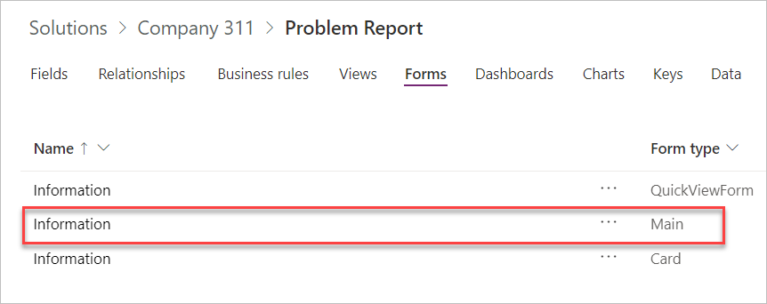

5.  Select the form section.

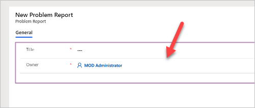

6.  Go to the **Properties** pane, change the **Section label** to **Problem details**, and enter **section\_problem\_report** for **Name**.

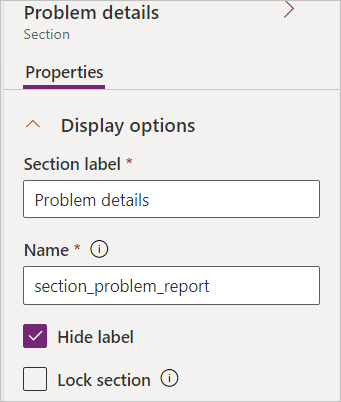

7.  While you still have the section selected, go to the **Fields** pane, and click on the **Building** field. The Building field will be added to the form.

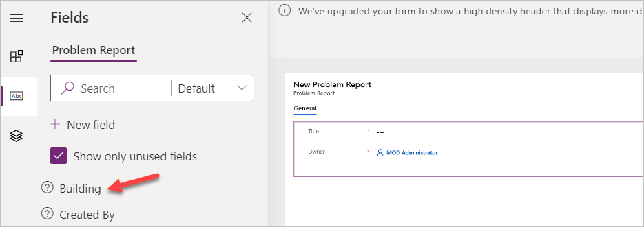

8.  Add the **Details**, and **Photo** fields to the form.

9.  Your form should now look like the image below. Select the **Details** field.

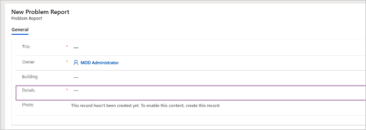

10. Go to the **Properties** pane and click to expand the **Formatting** section.

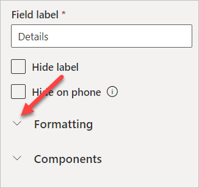

11. Change the **Field height** to **4**.

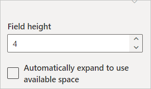

12. Select the **Components** from the toolbar.

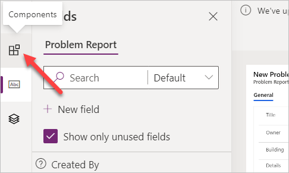

13. Select **1-Column section.**

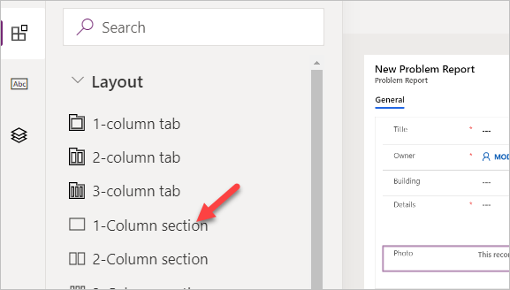

14. A new section should be added to the form. Select the new section.

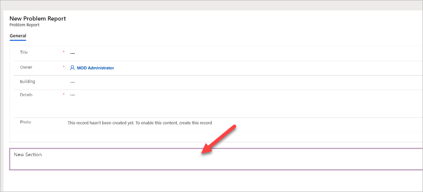

15. Go to the **Properties** pane, change the **Section label** to **Resolution details**, and change the **Name** to **section\_resolution\_details**.

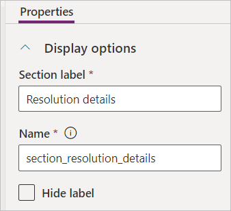

16. Select **Fields** from the toolbar.

17. Add **Department**, **Status Reason**, **Resolved on**, and **Resolution** fields to the **Resolution details** section.

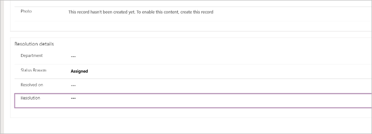

18. Select the **Resolution** field.

19. Go to the **Properties** pane and click to expand the **Formatting** section.

20. Change the **Field height** to **4**.

21. You form should now look like the image below. Click **Save**.

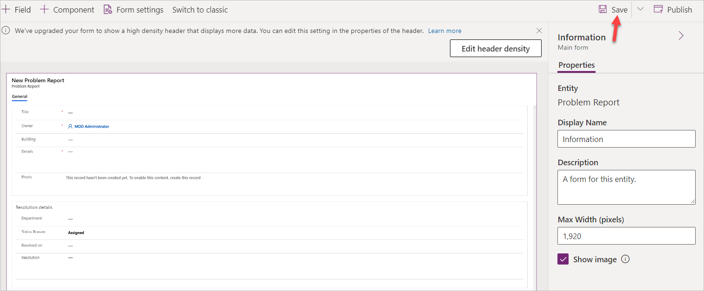

22. Click **Publish** and wait for the publishing to complete.

23. Click on the **\<- Back** button.

24. You should now be back to the entity.

25. Do not navigate away from this page.

#### **Task 2: Edit view**

1.  Select the **Views** tab and click to open the **Active Problem Reports** view.

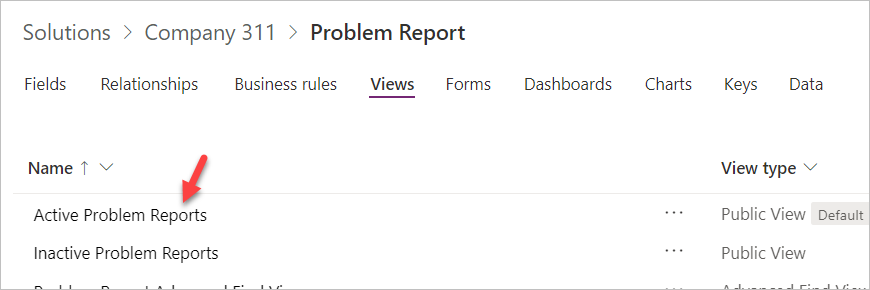

2.  Click **+ Add column** and select **Building**.

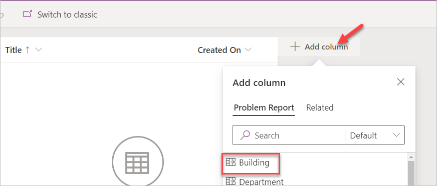

3.  Add **Location**, **Status Reason**, and **Owner** columns to the view. You will have to change the filter to All when adding status reason and owner columns.

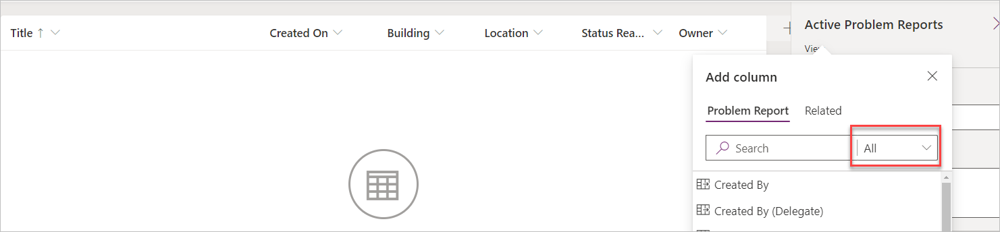

4.  Go to the view properties pane and click **Edit filters**.

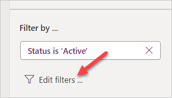

5.  Set the first filter to **Status Reason Equals New**.

6.  Click on the field where you **New** selected.

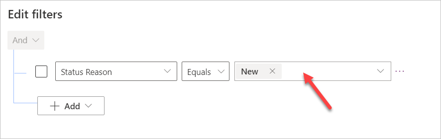

7.  Select **Assigned**.

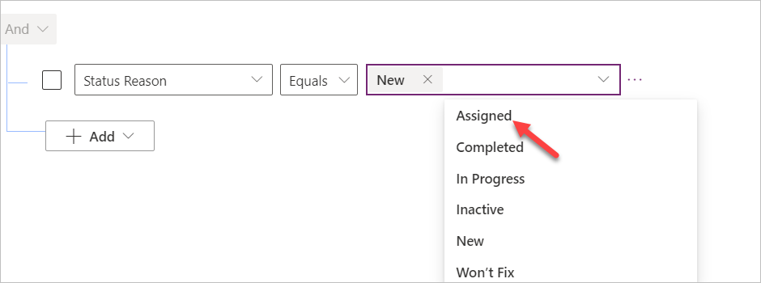

8.  Click on the filed again and select **In progress**.

9.  The filter should now look like the image below. Click **OK**.

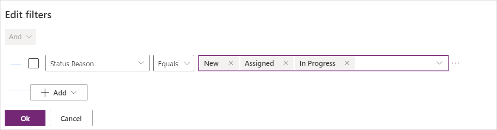

10. Click **Save**.

11. Do not navigate away from this page.

#### **Task 3: Create view from existing**

In this task, you will create a new view from the Active Problem Reports view.

1.  Click **Edit filters**.

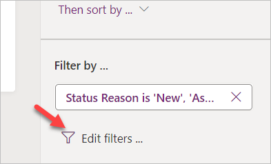

2.  Remove **In Progress** from the filter.

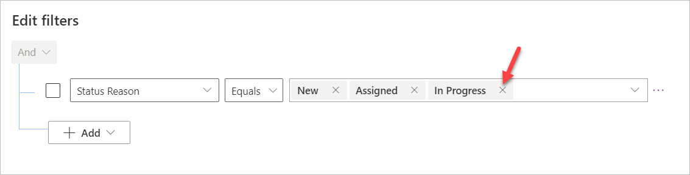

3.  Remove **Assigned** and **New** values form the filter.

4.  Select **Completed**.

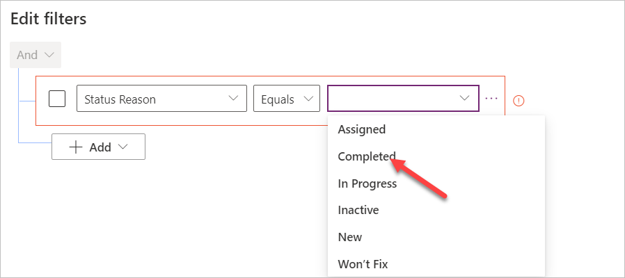

5.  Add **Won’t Fix** and **Inactive** values to filter.

6.  The filter should now look like the image below. Click **OK**.

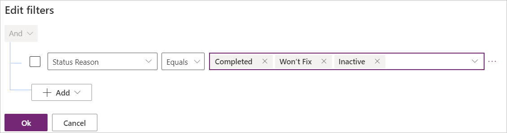

7.  Click on the chevron button next to the save button and select **Save As**.

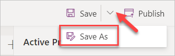

8.  Enter **Resolved Problems** for **Name** and click **Save**.

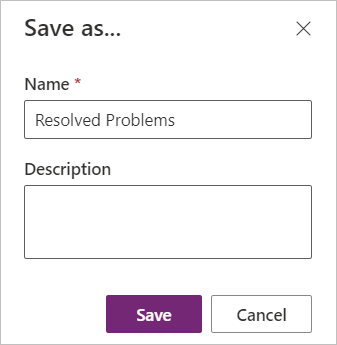

9.  Click on the **\<-Back Button**.

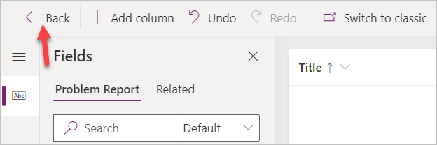

10. Go to the solution by clicking on the solution name.

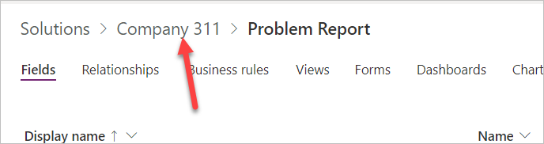

11. Click **Publish all customizations** and wait for the publishing to complete.

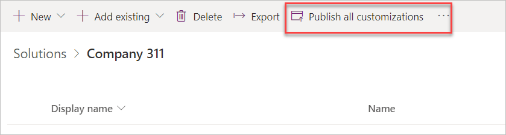

### **Exercise 4: Compose model-driven application**

In this exercise, you will create model-driven application.

#### **Task 1: Create new model-driven application**

1.  Navigate to the [Power Apps maker portal](https://make.powerapps.com/) and make sure you are in the correct environment.

2.  Select Solutions and click to open the **Company 311** solution.

3.  Click **+ New | App | Model-driven app**.

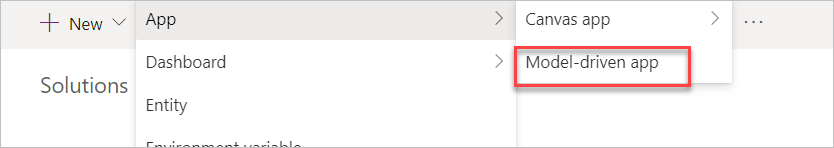

4.  Enter **Company 311 Admin** for name and click **Done**.

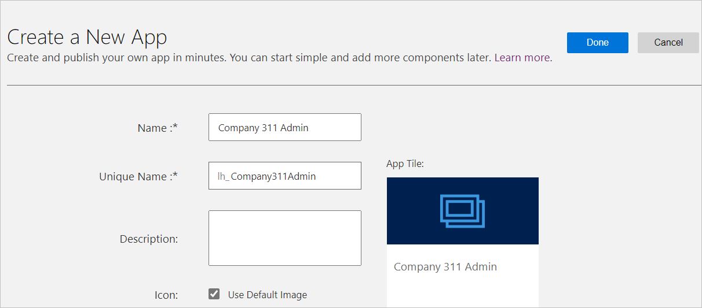

5.  Click Edit **Site Map.**

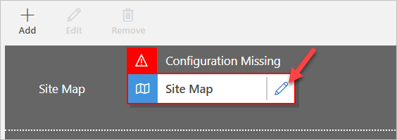

6.  Select the **New Area**.

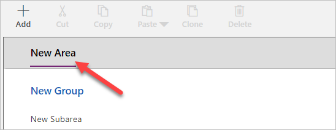

7.  Go to the **Properties** pane, enter **Manage Problems** for **Title**, and enter **area\_manage\_problems** for **ID**.

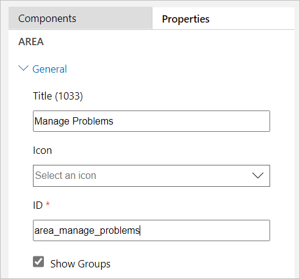

8.  Select the **New Group**.

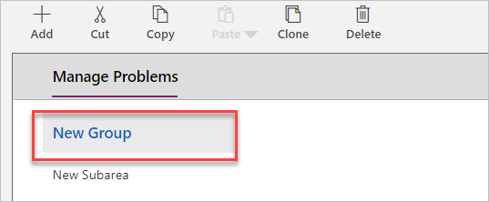

9.  Go to the **Properties**, enter **Problems** for **Title**, and enter **group\_problems** for **ID**.

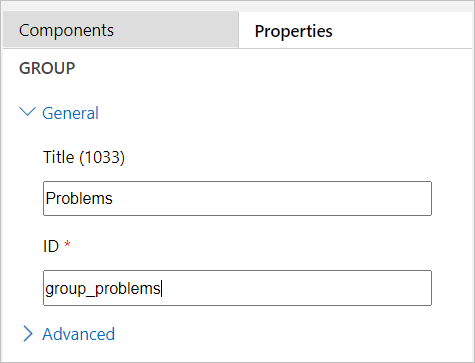

10. Select the **New Subarea**.

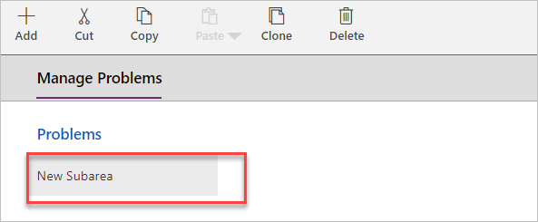

11. Go to the **Properties** pane, select **Entity** for **Type**, and select **Problem Report** for **Entity**.

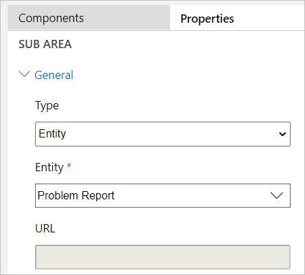

12. Click **+ Add**.

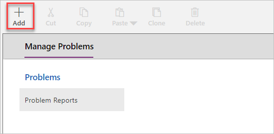

13. Select **Area**.

14. Select the **New Area** you just added.

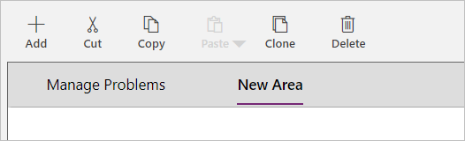

15. Go to the **Properties** pane, enter **Settings** for **Title**, and enter **area\_settings** for **ID**.

16. Select the **Settings** area and click **+ Add**.

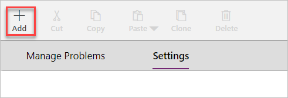

17. Select **Group**.

18. Select the **New Group** you just added.

19. Go to the **Properties** pane, enter **Taxonomy** for **Title**, and enter **group\_taxonomy** for **ID**.

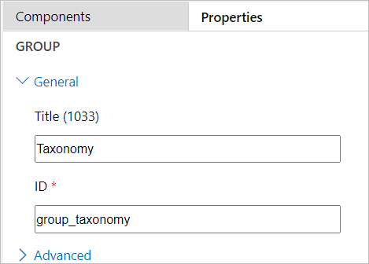

20. Select the **Taxonomy** group you just added and select the **Components** pane.

21. Drag **Subarea** and drop it under the **Taxonomy** group.

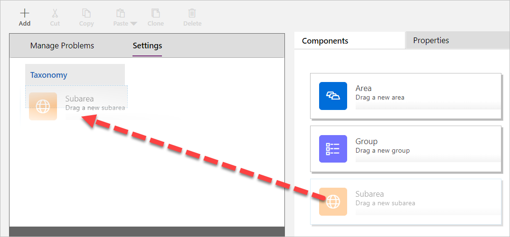

22. Select the **New Subarea**.

23. Go to the **Properties** pane, select **Entity** for **Type**, and select **Building** for **Entity**.

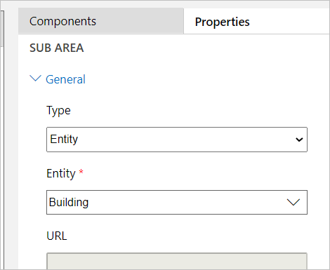

24. Add another **Subarea** component to the **Taxonomy** group.

25. Select the **New Subarea**.

26. Go to the **Properties** pane, select **Entity** for **Type**, and select **Department** for **Entity**.

27. The sitemap should now look like the image below. Click **Save** to save the sitemap.

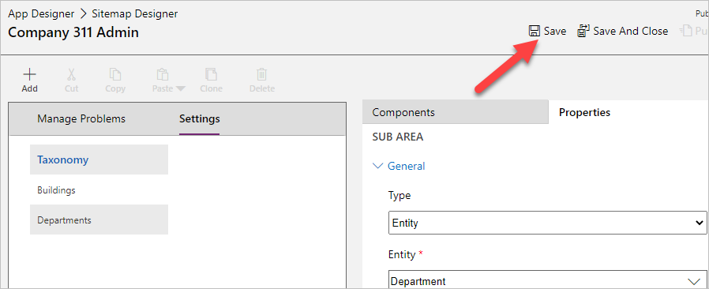

28. Click **Publish** to publish the sitemap and wait for the publishing to complete.

29. Go back to the **App Designer**.

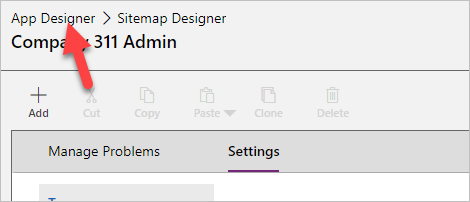

30. The application should now have three entities. Click **Save** to save the application.

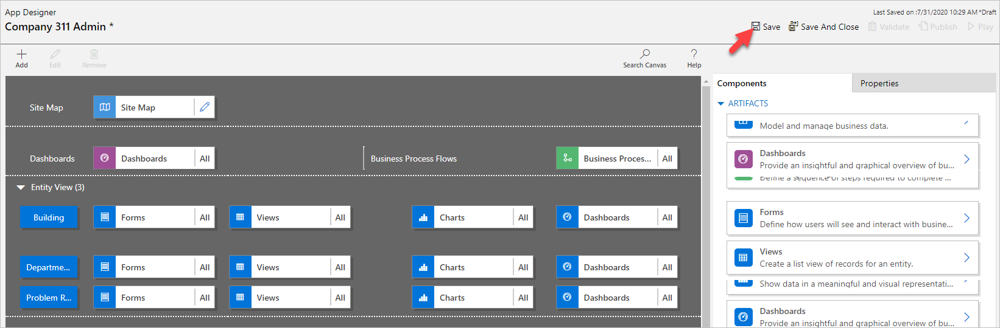

31. Click **Publish** to publish the application and wait for the publishing to complete.

32. Close the app designer browser tab or window.

33. Click **Done**.

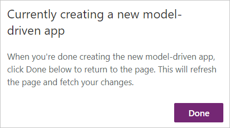

### **Exercise 5: Input data**

In this exercise, you will input data.

#### **Task 1: Input data**

1.  Navigate to the [Power Apps maker portal](https://make.powerapps.com/) and make sure you are in the correct environment.

2.  Select **Apps** and click to open the **Company 311 Admin** application you created.

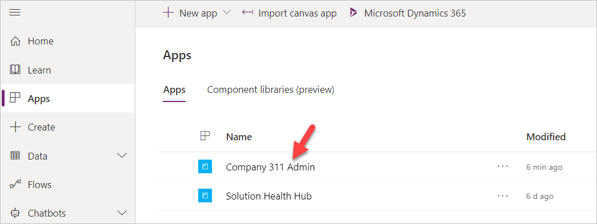

3.  Click **Change area**.

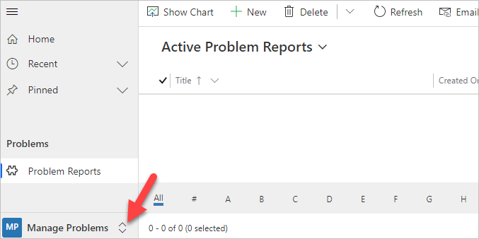

4.  Select **Settings** area.

5.  Select **Departments** and click **+ New**.

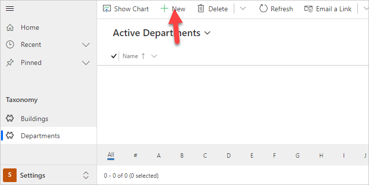

6.  Enter **Facility Maintenance** for **Name** and click **Save**.

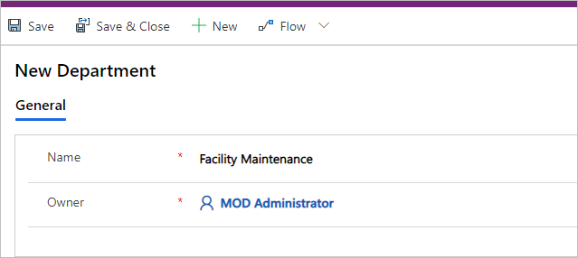

7.  Click **+ New** again.

8.  Enter **Human Resources** for **Name** and click **Save**.

9.  Click **+ New** one more time.

10. Enter **Marketing** for **Name** and click **Save**.

11. Select **Departments**.

12. You should now have three department records. Select **Buildings**.

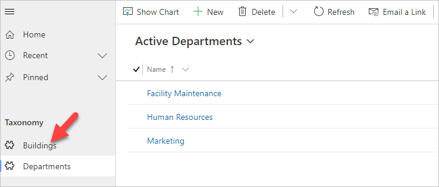

13. Click **+ New**.

14. Enter **San Francisco Main Campus** for **Name** and click **Save & Close**.

15. Click **+ New** again.

16. Enter **London Paddington** for **Name** and click **Save & Close**.

17. You should now have two building records. Click **Change area**.

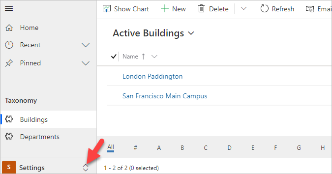

18. Select **Manage Problems**.

19. Click **+ New**.

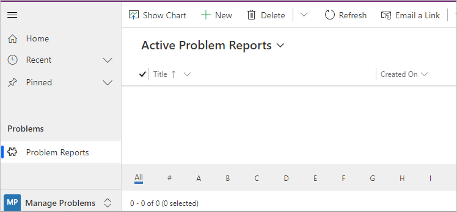

20. Enter **Broken door** for **Title**, select **San Francisco Main Campus** for **Building**, enter **The main entrance door will not open all the way** for **Details**, and click Save

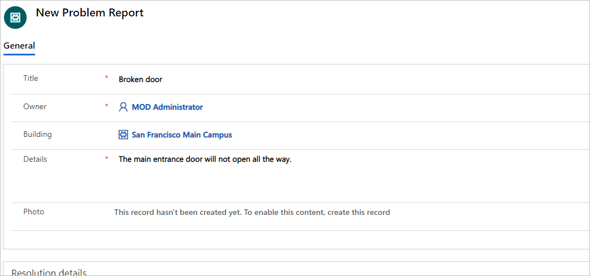

21. Click on the **Photo** field.

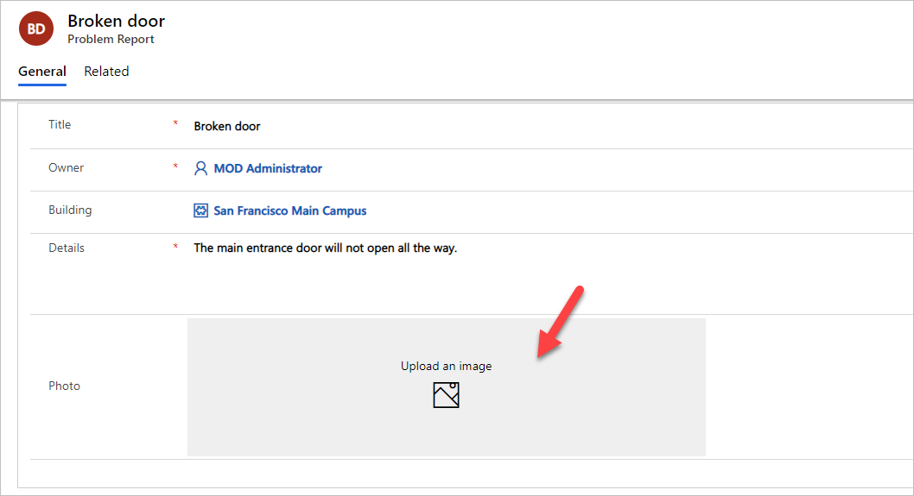

22. Select an image from your device.

23. The image should now show on the form.

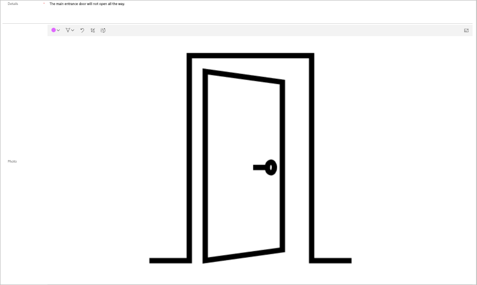

24. You may add more records.

### **Exercise 6: Import data**

In this exercise, you will import sample data into your environment. Records are imported by a Power Automate flow that you will first import using a solution.

#### **Task 1: Import solution**

1.  Navigate to the [Power Apps maker portal](https://make.powerapps.com/) and make sure you are in the correct environment.

2.  Select **Solutions** and click **Import**.

3.  Click **Choose** **File**.

4.  Select the **DataImport.zip** solution file located in the lab resources folder and click **Open**.

5.  Click **Next**.

6.  Click **Next** again.

7.  Click **Import** and wait for the solution import to complete.

8.  Click **Publish all customizations** and wait for the publishing to complete.

9.  Click **Close** the to close the solution import wizard.

### **Task 2: Review and run flow**

1.  Navigate to the [Power Apps maker portal](https://make.powerapps.com/) and make sure you are in the correct environment.

2.  Select **Solutions** and click to open the **Data Import** solution you imported.

3.  Click to open the **Import Data** flow.

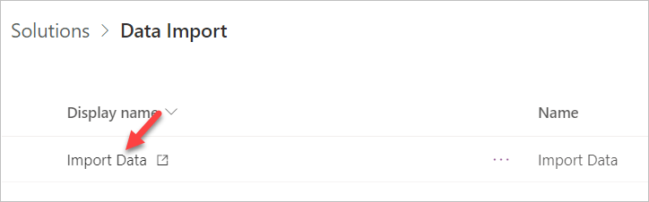

4.  Click **Edit**.

5.  Click **Continue**.

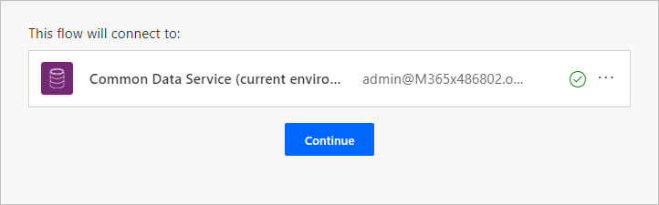

6.  Click to expand the **Input** **Data** step.

7.  Review the Json text in the value field. This is the data that will be imported into your environment

8.  Expand the **Each Department** for each control

9.  Expand and review the **Upsert Department** step.

10. Expand and review the rest of the steps.

11. Click **Save** to save the flow.

12. Click on the button and go back to the flow details page.

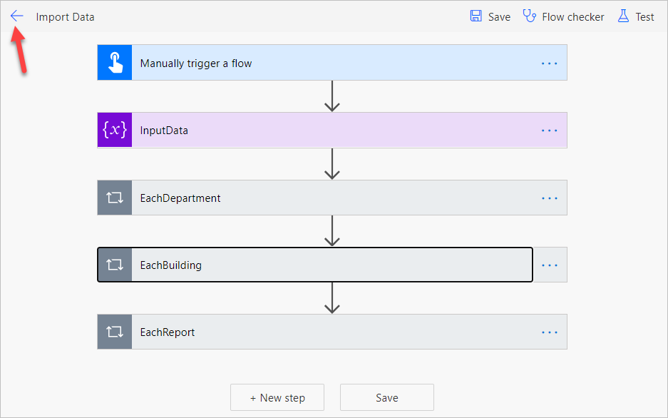

13. Click **Run**.

14. Click **Run flow**.

15. Click **Done**.

16. Wait for the flow run to complete. Click on the **Refresh** button to check if the flow run completed successfully.

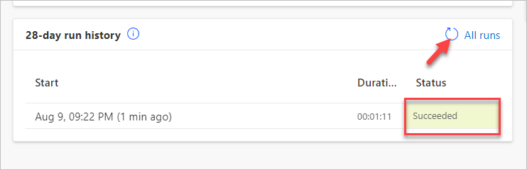

17. Close the flow editor browser window or tab.

18. Click **Done** on the popup

### **Task 3: Review imported data**

1.  Navigate to the [Power Apps maker portal](https://make.powerapps.com/) and make sure you are in the correct environment.

2.  Select **Apps** and click to open the **Company 311 Admin** application.

3.  Select Problem Reports and change the view to My Reports. You should see at least three new records.

4.  Click to open one of the **Problem Report** records.

5.  Click on the **Building** lookup and make sure building records were imported.

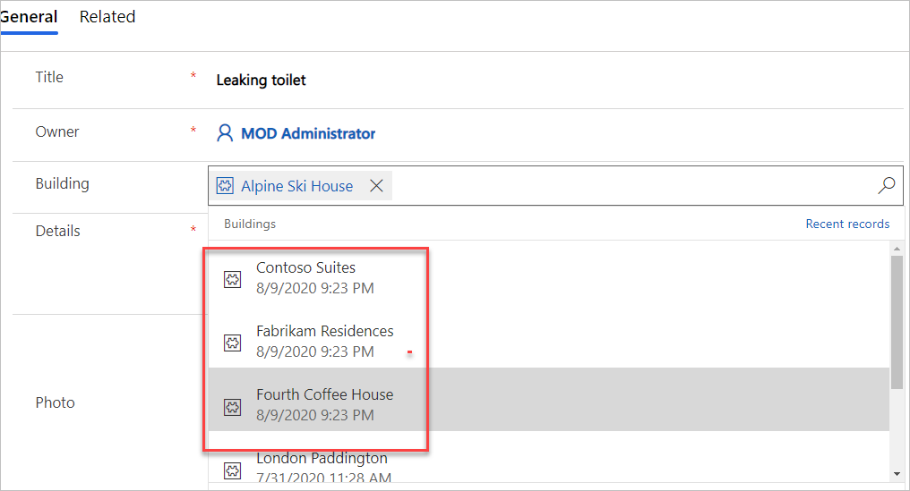

6.  Scroll down and click on the **Department** lookup.

7.  Make sure the department records got imported.

### **Bonus exercise**

  - Deal with problem report assignment within a department.
