# **Lab 03: Canvas app**

## **What you will learn**

  - Import and use a pre-built component library

  - Create a Power Apps canvas app

  - Connect to a data source

  - Filter data

  - Create data records

  - Use images with data records

## **High-level lab steps**

  - Exercise 1 – Import company components

  - Exercise 2 – Create app and layout main screen (including list of my items)

  - Exercise 3 – Submit New Report

## **Prerequisites**

Must have completed Lab 02 – Data model and model-driven app

## **Detailed steps**

### **Exercise 1: Create canvas application**

In this exercise, you will import a solution with shared components, create a view for the problem report entity, and create a canvas application.

#### **Task 1: Import component library solution**

In this task, you will import the shared components solution into your environment. This shared component library was built by another team at your company.

1.  Navigate to the [Power Apps maker portal](https://make.powerapps.com/) page and make sure you are in the correct environment.

2.  Select **Solutions** and click **Import**.

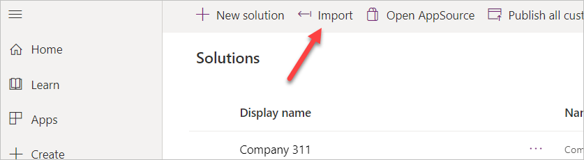

3.  Click **Choose File**.

4.  Go to the course resources folder, select the **Shared components** solution, and click **Open**.

5.  Click **Next**.

6.  Click **Import**.

7.  Click **Publish All Customizations** and wait for the publishing to complete.

8.  Click **Close**.

9.  You should now see the **Shared Components** solution you imported. Click to open the **Shared Components** solution you imported.

10. The solution should have one item in it, **Lamna Healthcare Shared Components**.


> [!IMPORTANT]
> There is an issue where importing the app as part of a solution may not add it to your components library. The following steps are designed to resolve the issue.

11. Navigate to **Apps**, Select the **Lamna Healthcare Shared Components App**.
12. Click the **Edit Icon** to edit the app.

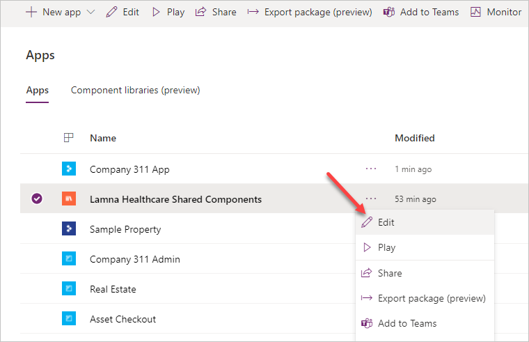

13. After the app opens, click **File** > **Save As**.
14. Save the app as **Lamna Healthcare Share Components A**.


15. Click **OK**.
16. Close the **Lamna Healthcare Shared Components** tab in your browser.

#### **Task 2: Create view**

In this task, you will create a view that will show the current user’s problem reports. Later you will use this view with the filter function in the canvas app.

1.  Navigate to the [Power Apps maker portal](https://make.powerapps.com/) page and make sure you are in the correct environment.

2.  Select **Solutions** and click to open the **Company 311** solution.

3.  Locate and click to open the **Problem Reports** entity.

4.  Select the **Views** tab and click to open the **Active Problem Reports** view.

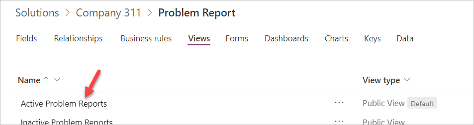

5.  Click **Edit filters**.

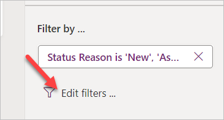

6.  Change the filter to **Created By Equals current user** and click **OK**.

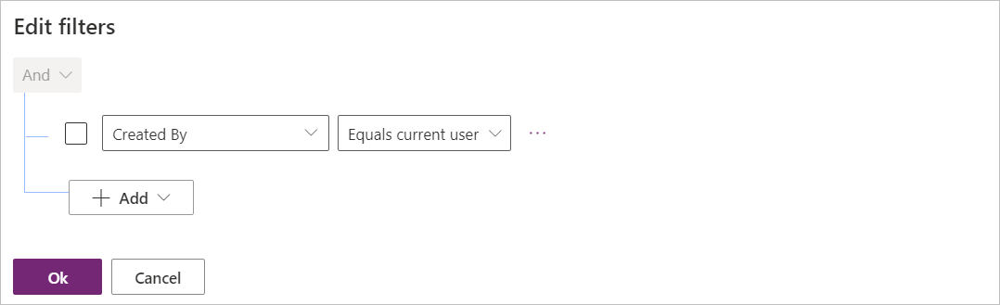

7.  Click on the chevron button next to the Save button and select **Save As**.

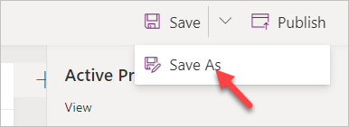

8.  Enter **My Reports** for **Name** and click **Save**.

9.  Click **Publish** and wait for the publishing to complete.

10. Click on the **Back** button.

#### **Task 3: Create the user application**

In this task, you will create a canvas application using the phone form factor.

1.  Navigate to the [Power Apps maker portal](https://make.powerapps.com/) page and make sure you are in the correct environment.

2.  Select **Solutions** and click to open the **Company 311** solution.

3.  Click **+ New | App |Canvas app | Phone form factor**.

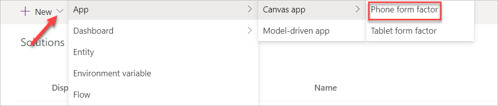

4.  Click **Skip** on the welcome screen.

5.  Select your **Region/Country** and click **Get started**.

6.  Click **File** and select **Save**.

7.  Enter **Company 311 Phone App** for name and click **Save**.

8.  Click on the back button.

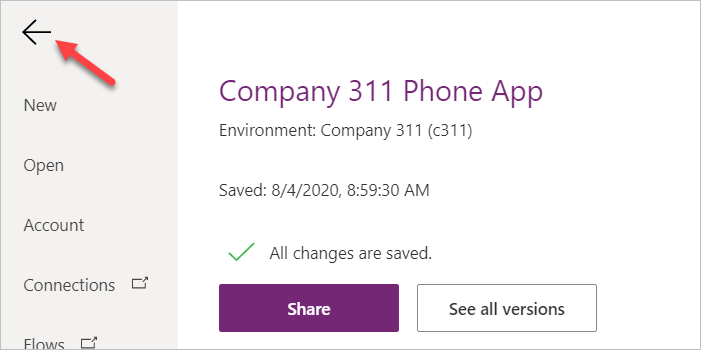

9.  Go to the Tree view and double click **Screen1**.

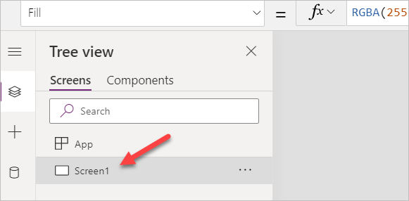

10. Rename the screen **Main Screen**. It’s always a good idea to give your screens a meaningful name.

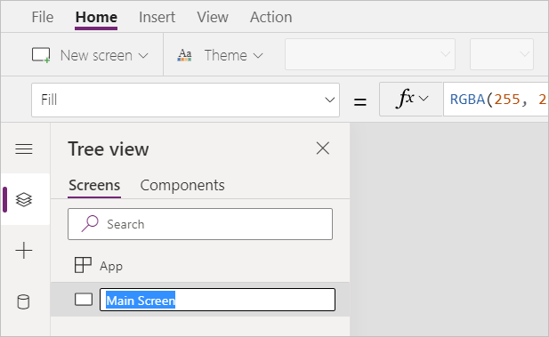

11. Select the **Main Screen** and click **Insert**.

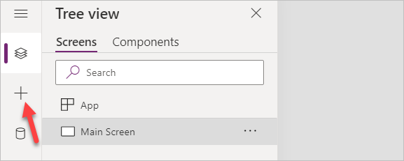

12. Select **Get more Components**.

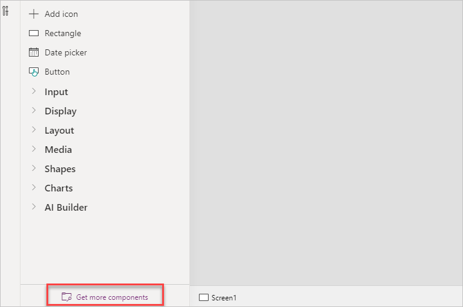

13. Expand the **Lamna Healthcare Shared Components A** Library, and select **Header** and **Tab Control**.

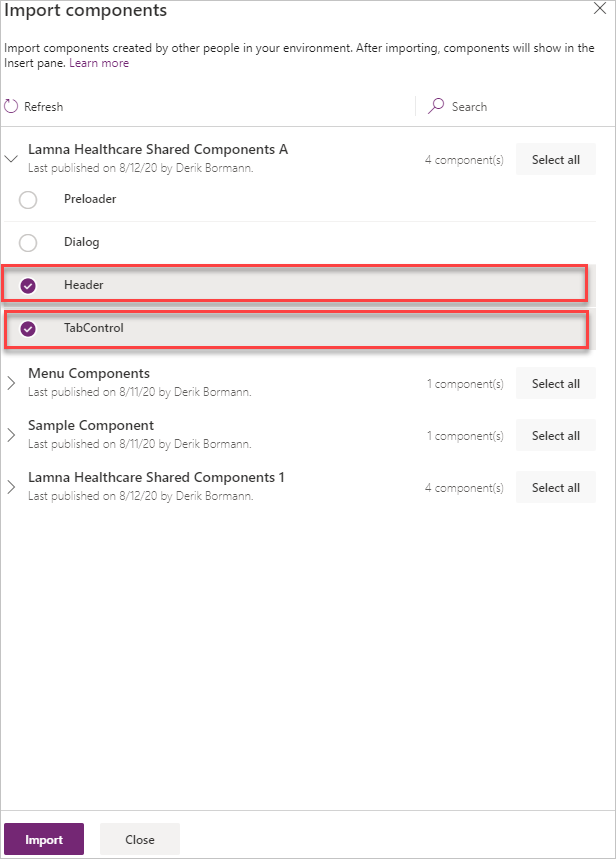

14. Click **Import**.

15. Expand **Library components**, select **Header Control** and **Tab Control**. These are both components from the library you imported earlier in the lab.

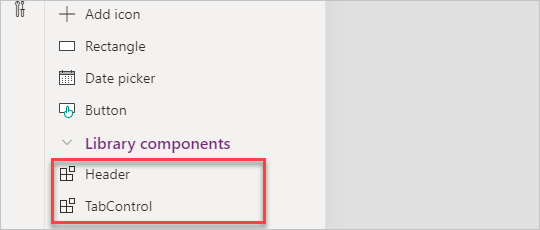

16. Move the **Tab Control** to the bottom of the screen and the **Header Control** to the top of the screens.

18. Select the **Header Control** and change the **Text** value to **"Company 311".**

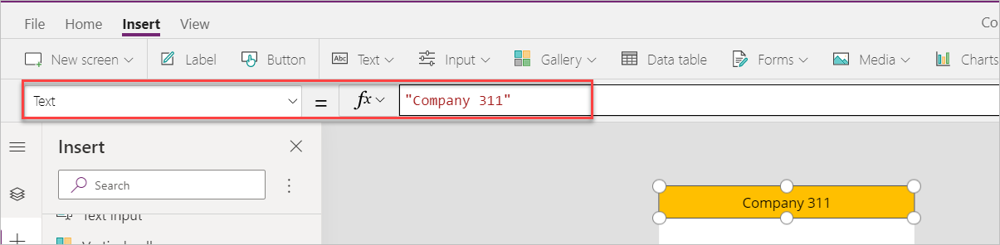

19. Right click on the Main Screen and select Duplicate screen.

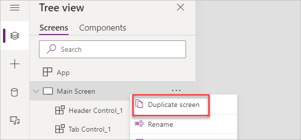

20. Rename the new screen **New Reports Screen**.

21. Select the **Tree view**, select **App** and change the **OnStart** value to the formula below. This formula will create a new variable named My Tabs and set it to a table of tab items.

```javascript
Set('My Tabs', Table( {
	Label: "My Reports",
	Screen: 'Main Screen',
	Icon: "",
	SelectedIcon:""
},
{
	Label: "New Report",
	Screen: 'New Report Screen',
	Icon: "",
	SelectedIcon:""
}
))
```

> [!IMPORTANT]
> When expressions are copied, the quotes and double quotes are sometimes replaced with their "smart" counterparts which are not valid in formulas. If you copy and paste the expression above, make sure the resulting formula does not contain any errors.     

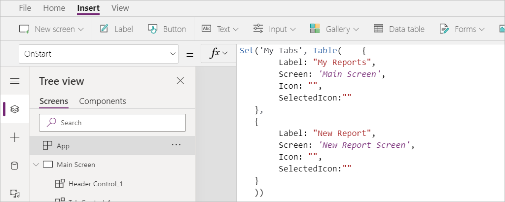

22. Select the **Tab Control** in the **Main Screen** and change the **Items** value to **‘My Tabs’**.

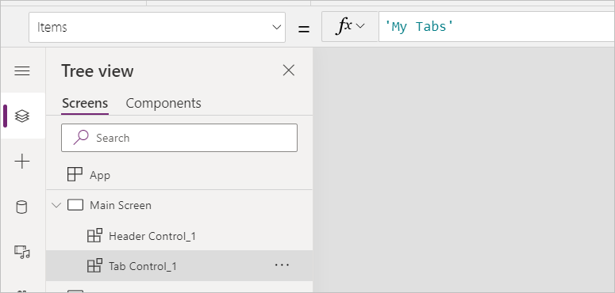

23. Change the **SelectedColor** value to **WhiteSmoke**.

24. Select the **Tab Control** inside the **New Report Screen** and set the Item value to **‘My Tabs’**.

25. Change the **SelectedColor** value to **WhiteSmoke**.

26. Click on the **…** button of the **App** and select **Run OnStart**.

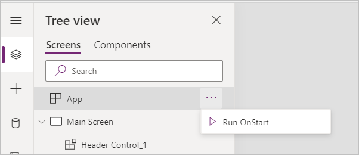

27. Your tabs should now show the two tabs you added.

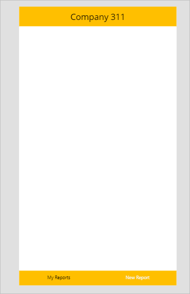

28. Do not navigate away from this page.

### **Exercise 2: My reports**

In this exercise, you will add a gallery that will show reports created by the current logged in user.

#### **Task 1: Add gallery**

1.  Select the **Main Screen**, go to the **Insert** tab, click **Gallery**, and select **Vertical**.

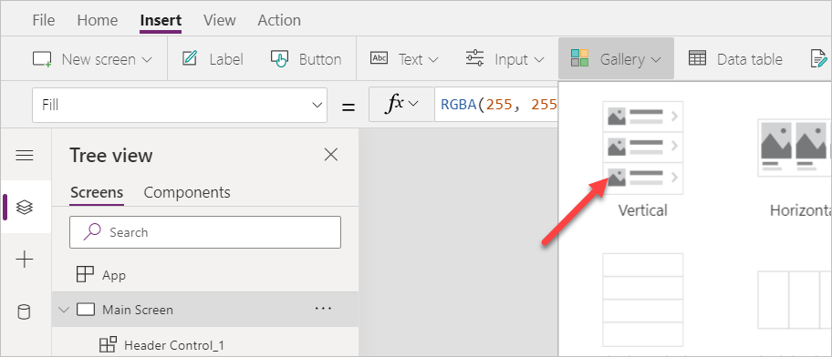

2.  Rename the new gallery **My Reports Gallery**.

3.  Resize and reposition **My Reports Gallery** and make sure the screen looks like the image below.

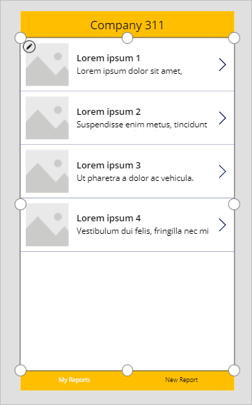

4.  Select **My Reports Gallery**, go to the **Properties** pane, and select **Problem Reports** for **Data Source**. If you do not see Problem Reports, click See all entities.

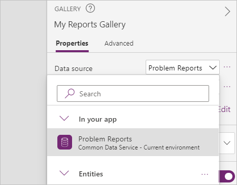

5.  Select the **My Reports** view you created for **View**.

6.  Click **Edit Fields**.

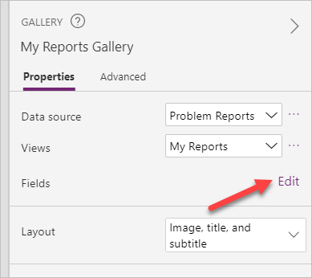

7.  Change Subtitle1 to **statuscode**. This is the Status Reason field.

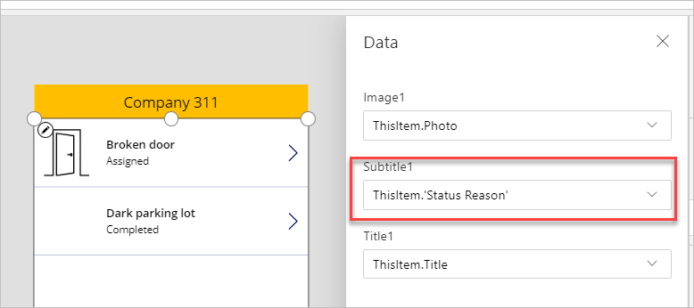

8.  Click File and then click Save.

9.  Click on the Back button.

10. Do not navigate away from this page.

### **Exercise 3: Allow removing reports**

In this exercise, you will allow unassigned reports to be removed. This will allow users to easily remove any accidental reports.

#### **Task 1: Allow remove**

1.  Select the **Main Screen**, go to the **Insert** tab, click **Gallery**, and select **Vertical**.

2.  Select the **Icon** inside the **My Reports Gallery**.

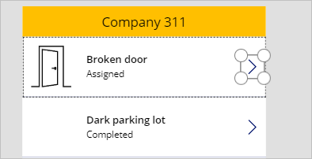

3.  Change the **Icon** value to **Icon.Trash**.

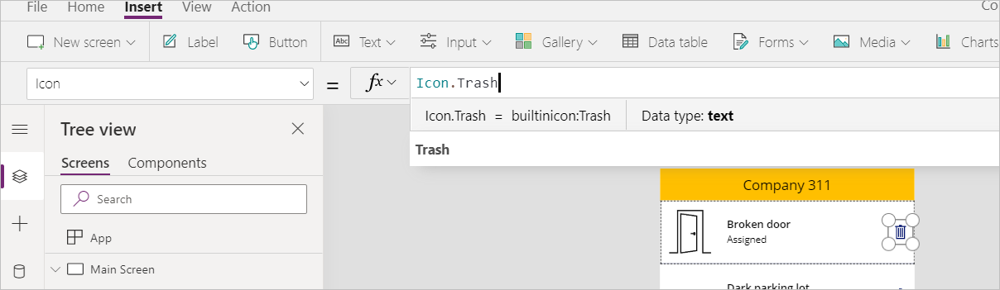

4.  Change the **Visible** value to the formula below. This formula will hide the icon if the status reason is not New.

`If(Text(ThisItem.'Status Reason') = "New", true, false)`

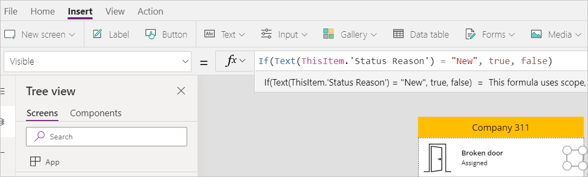

5.  Make sure you still have the icon selected. Change the **OnSelect** value to the formula below. This formula will remove item from the data source.

`Remove('Problem Reports', ThisItem)`

6.  Click **File** and then click **Save**.

7.  Do not navigate away from this page.

### **Exercise 4: Add new report**

In this exercise, you will add a form to submit new problem reports.

#### **Task 1: Add new report form**

1.  Select the **New Report Screen**, go to the **Insert** tab, click **Form**, and select **Edit**.

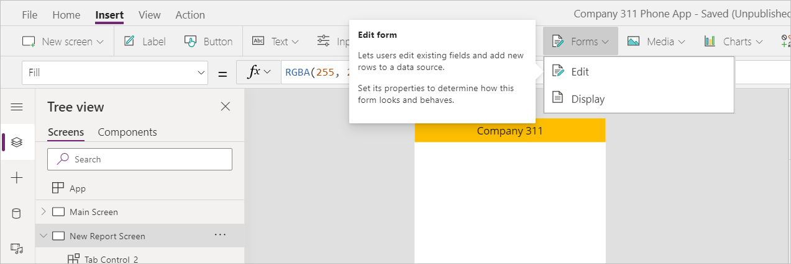

2.  Rename the form **New Report Form**.

3.  Select **New Report Form**, go to the **Properties** pane, and select **Problem Report** for **Data source**.

4.  Click **Edit fields**.

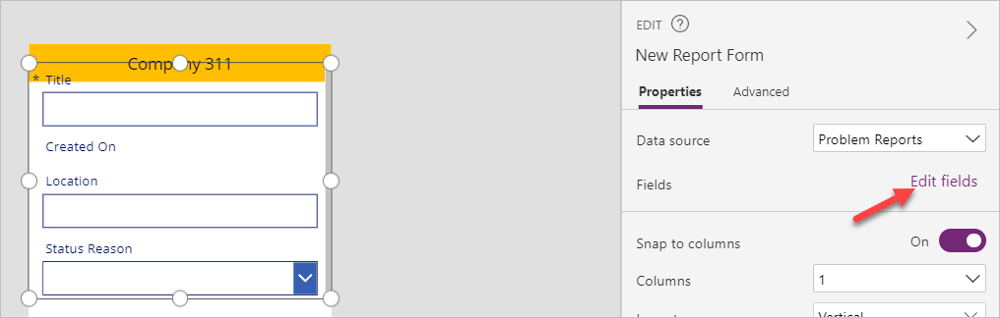

5.  Remove the **Status Reason** field.

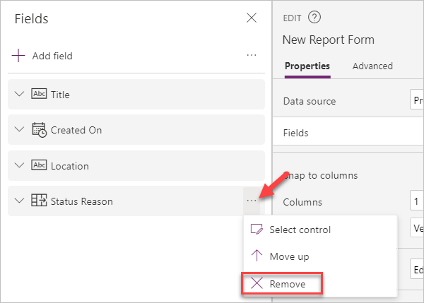

6.  Remove the **Created On** field.

7.  Remove the **Location** field.

8.  Click **+ Add field**.

9.  Select **Details**, **Building**, **Department**, and **Photo**, and then click **Add**.

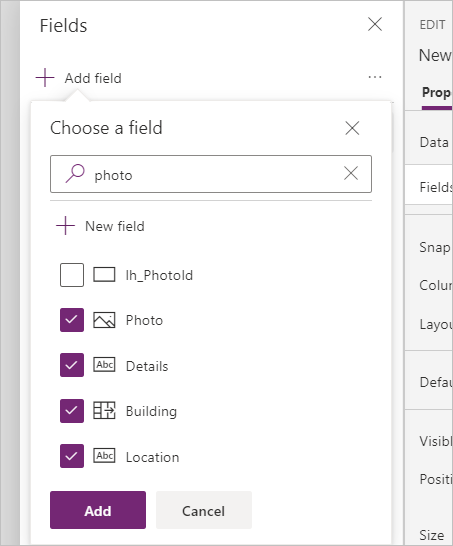

10. Resize and reposition the form so it takes most of the page and leave enough room for a button in the bottom.

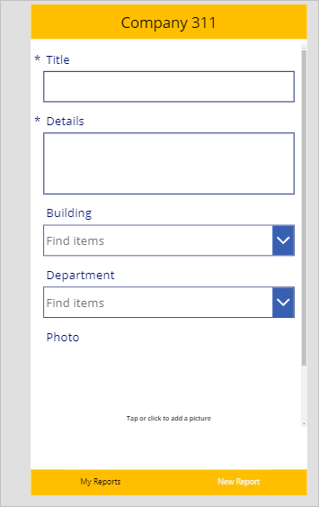

11. Select the **New Report Screen**.

12. Go to the **Insert** tab and select **Button**.

13. Rename the button **Submit Report**.

14. Place the button below the form and make it stretch across the screen

15. Change the **Submit Report** button text to **Submit**

16. Select the Submit Report button and change the **OnSelect** value to the formula below. This formula will create a new record and clear the form when the button is clicked.

`SubmitForm('New Report Form'); NewForm('New Report Form')`

17. Select the **New Report Form**.

18. Change the **OnSuccess** value to the formula below. This formula will show a notification after the new record gets created.

`Notify("Created new problem report record")`

19. Select the **New Report Screen**.

20. Set the **OnVisible** value to the formula below. This formula will create a new form when the screen becomes visible.

`NewForm('New Report Form')`

21. Click **File** and then click **Save**.

22. Click on button.

23. Do not navigate away from this page.

### **Exercise 5: Test the application**

In this exercise, you will test the canvas application you created by submitting a problem report.

#### **Task 1: Test application**

1.  Select the **Main Screen** and click **Preview the app**.

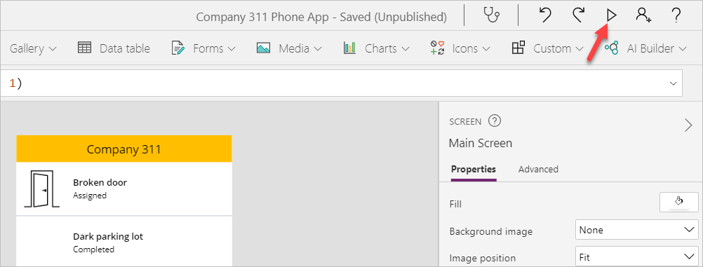

2.  The application should load, and the list should show all the reports you created.

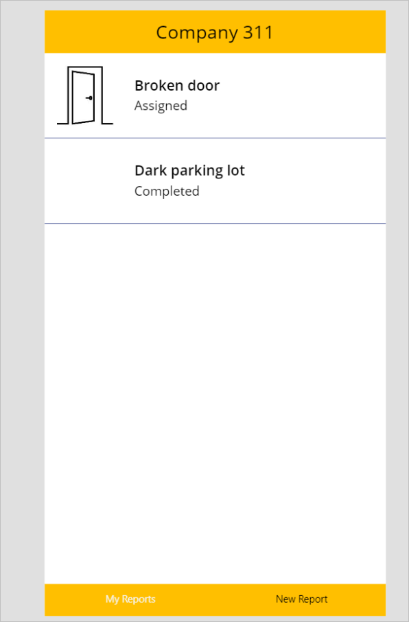

3.  Select the **New Report** tab.

4.  The **New Report Form** should load. Fill out the form and click on the **Photo** field.

5.  Select an image.

6.  Click **Submit**

7.  The record should get created successfully and you should see the success message.

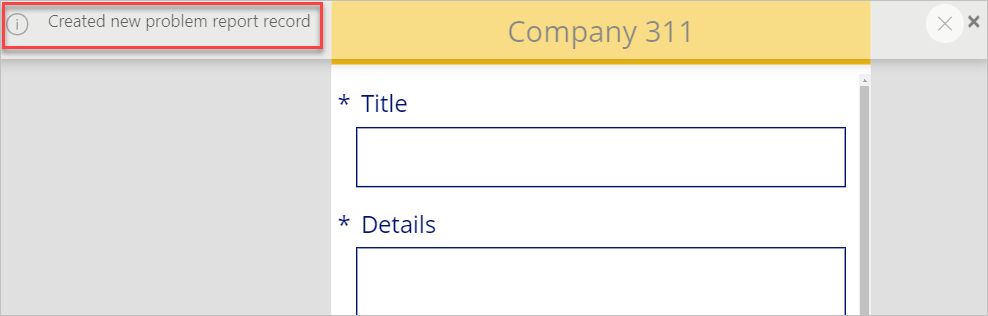

8.  Select the **My Reports** tab.

9.  You should see the new report you created. Click **Delete** to test the delete.

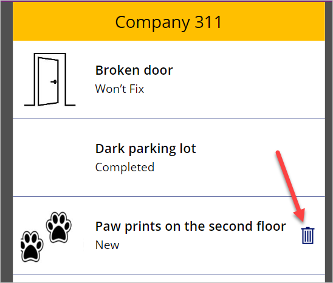

10. The record should be deleted and removed from the list.

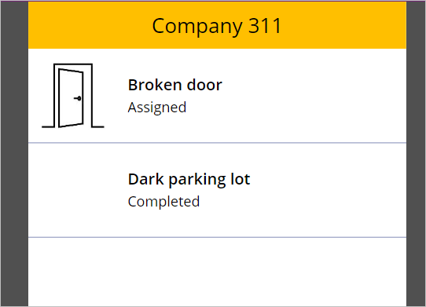

11. Close the application.
