---
lab:
    title: 'Lab: Business Process Flows and Business Rules'
    module: 'Module 3: Building model-driven apps'
---

> [!NOTE]
> Effective November 2020:
> - Common Data Service has been renamed to Microsoft Dataverse. [Learn more](https://aka.ms/PAuAppBlog)
> - Some terminology in Microsoft Dataverse has been updated. For example, *entity* is now *table* and *field* is now *column*. [Learn more](https://go.microsoft.com/fwlink/?linkid=2147247)
>
> This content will be updated soon to reflect the latest terminology.

# Lab 04: Business Process Flows and Business Rules

In this lab you will enhance the data model and improve the app behavior by adding a business process flow and a business rule.

## What you will learn

  - How to identify stages in a Business Process Flow (BPF)

  - How to create and use a BPF

  - How to use a business rule to implement logic

## High-level lab steps

  - Exercise 1 – Create BPF lifecycle of problem report
    
      - Route 
      
      - Fix 
      
      - Resolved 

  - Exercise 2 – Business rule to not allow close without resolution

## Prerequisites

* Must have completed **Lab 02: Data model and model-driven app**

## Detailed steps

### Exercise 1: Create business process flow

In this exercise, you will create a business process flow for the problem report entity.

#### Task 1: Customize entity

In this task, you will add a lookup field to the problem report entity.

1.  Navigate to the [Power Apps maker portal](https://make.powerapps.com/) page and make sure you are in the correct environment.

2.  Select **Solutions** and click to open the **Company 311** solution.

3.  Locate and click to open the **Problem Report** entity.

4.  Make sure you have the **Fields** tab and click **+ Add field**.

5.  Enter **Assign to** for **Display name**, select **Lookup** for **Data type**, select **User** for **Related table**, and click **Done**.

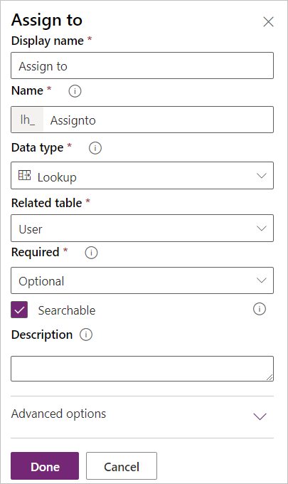

6.  Click **Save entity**.

7.  Go back to the solution by clicking on the solution name.

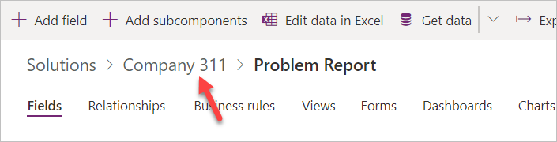

8.  Click **Publish all customizations** and wait for the publishing to complete.

#### Task 2: Create business process flow

In this task, you will create a business process flow for the problem report entity.

1.  Navigate to the [Power Apps maker portal](https://make.powerapps.com/) page and make sure you are in the correct environment.

2.  Select **Flows**.

3.  Select the **Business process flows** tab and click **+ New**.

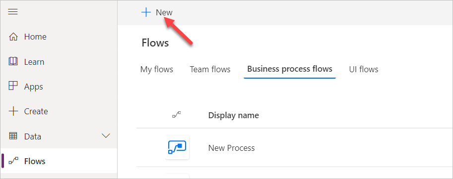

4.  Enter **Problem resolution process** for **Name**, select **Problem Report** for **Entity**, and click **Create**.

5.  Select the **New stage**, go to the **Properties** pane, change the **Display Name** to **Route**, and click **Apply**.

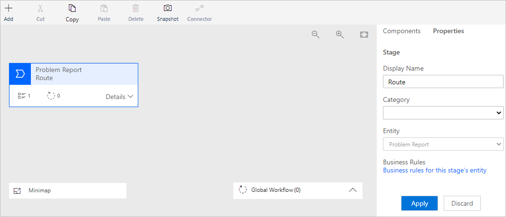

6.  Expand **Details** of the **Route** stage.

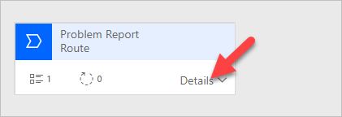

7.  Select **Data Step \#1**, go to the **Properties** pane, select **Building** for **Data Field**, and click **Apply**.

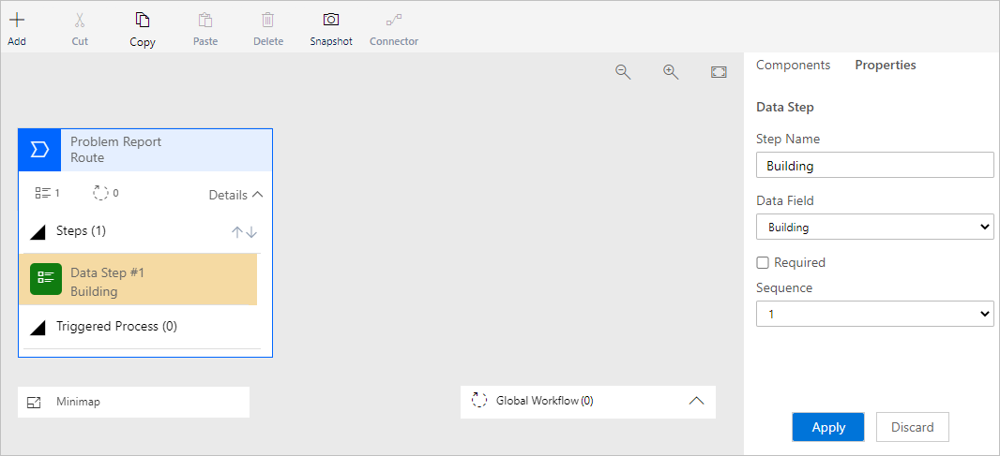

8.  Click **+ Add** and select **Add Data Step**.

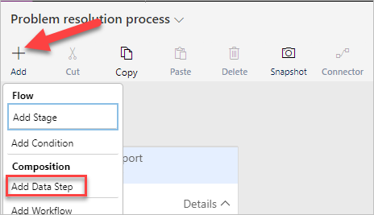

9.  Add the data step below the **Building** data step.

10. Select the new data step, go to the **Properties** pane, select **Location** for **Data Field**, and click **Apply**.

11. Click **+ Add** again and select **Add Data Step**.

12. Add the new data step below the **Location** data step.

13. Select the new data step, go to the **Properties** pane, select **Department** for **Data Field**, and click **Apply**.

14. The **Route** stage should now look like the image below.

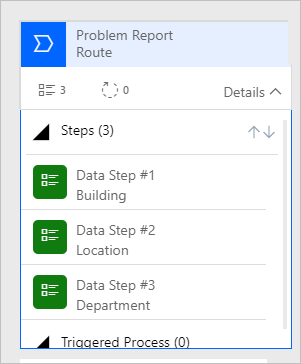

15. Click **+ Add** and select **Add Stage**.

16. Add the new stage after the **Route** stage.

17. Select the stage, go to the **Properties** pane, enter **Fix** for **Display Name**, and click **Apply**.

18. Expand **Details** of the **Fix** stage.

19. Select **Data Step \#1** of the **Fix** stage.

20. Go to the **Properties** pane, select **Assign to** for **Data Field**, and click **Apply**.

21. Click **+ Add** and select **Add Stage**.

22. Add the new stage after the **Fix** stage.

23. Select the new stage, go to the **Properties** pane, enter **Resolve** for **Display Name**, and click **Apply**.

24. Expand **Details** of the **Resolve** stage.

25. Select **Data Step \#1** of the **Resolve** stage.

26. Go to the **Properties** pane, select **Resolution** for **Data Field**, and click **Apply**.

27. Click **+ Add** and select **Add Data Step**.

28. Add the new data step below the **Resolution** data step.

29. Select the new data step, go to the **Properties** pane, select **Resolved on** for **Date Field**, and click **Apply**.

30. The Business process flow should now look like the image below. Click **Save**.

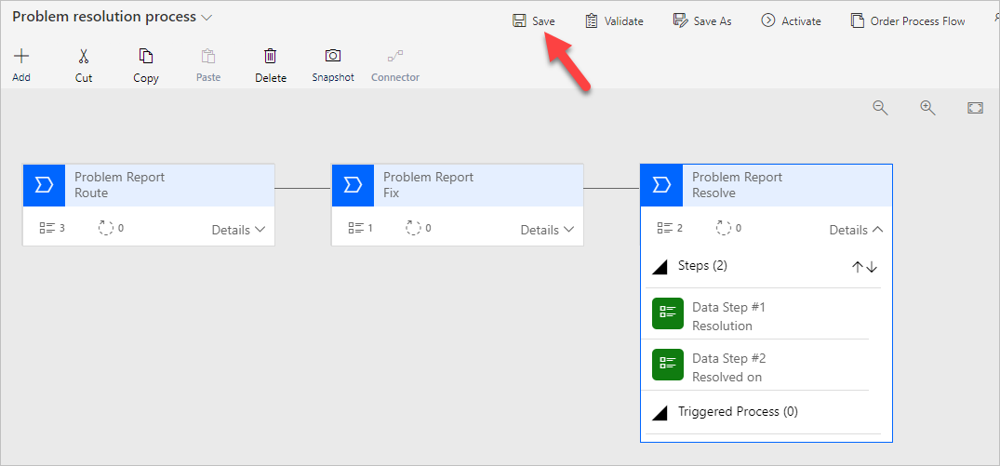

31. Click **Activate**.

32. Confirm activation.

33. Close the process editor browser window or tab.

#### Task 3: Add business process flow to solution

In this task, you will add the business process flow you created to the Company 311 solution.

1.  Navigate to the [Power Apps maker portal](https://make.powerapps.com/) page and make sure you are in the correct environment.

2.  Select **Solutions** and click to open the **Company 311** solution.

3.  Click **+ Add existing** and select **Process**.

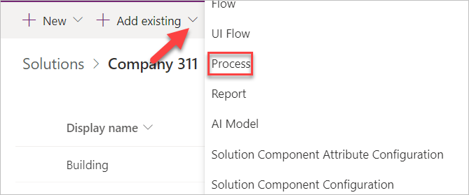

4.  Search for problem, select **Problem** resolution process, and click **Add**.

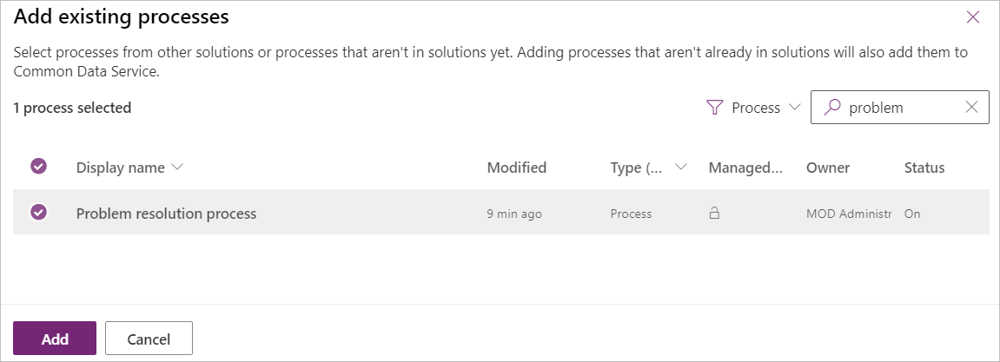

5.  Click **Publish all customizations** and wait for the publishing to complete.

### Exercise 2: Create business rule

In this exercise, you will create a business rule that will block completion of problems without resolution.

#### Task 1: Create business rule

1.  Navigate to the [Power Apps maker portal](https://make.powerapps.com/) page and make sure you are in the correct environment.

2.  Select **Solutions** and click to open the **Company 311** solution.

3.  Locate and click to open the **Problem Report** entity.

4.  Select the **Business rules** tab and click **Add business rule**.

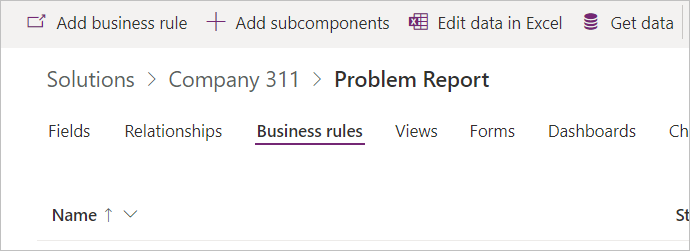

5.  Make sure the **Scope** is set to **Entity** and click **Show details**.

6.  Change **Business rule name** to **Completion rule** and click **Hide details**.

7.  Select the **Condition**.

8.  Go to the **Properties** pane and change the **Display name** to **Resolution required**.

9.  Scroll down to **Rule 1**, select **Status Reason** for **Field**, select **Equals** for **Operator**, select **Value** for **Type**, select **Completed** for **Value**, and click **Apply**.

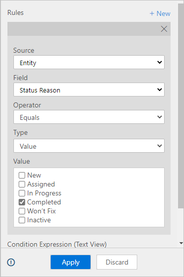

10. Click **+ New**.

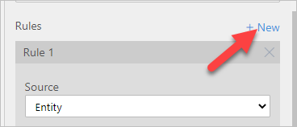

11. Scroll down to **Rule 2**, select **Resolution** for **Field**, select **Does not contain data** for **Operator**, make sure **And** is selected for **Rule Logic**, and click **Apply**.

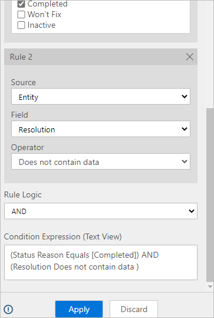

12. Click **+ Add**.

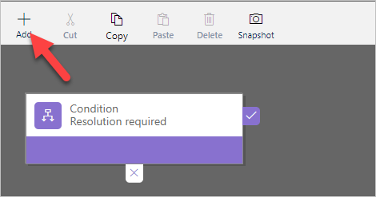

13. Select **Add show error message**.

14. Add the action on the true path of the condition.

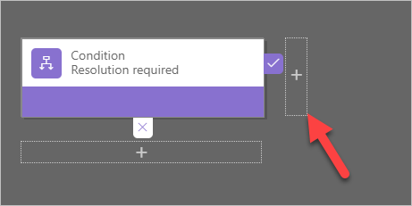

15. Select the new action, go to the **Properties** pane, enter **Show message** for **Display Name**, select **Status Reason** for **Field**, enter **The Problem must have a resolution before it can be closed** for **Message**, and click **Apply**.

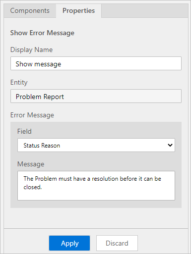

16. The business rule should now look like the image below. Click **Save**.

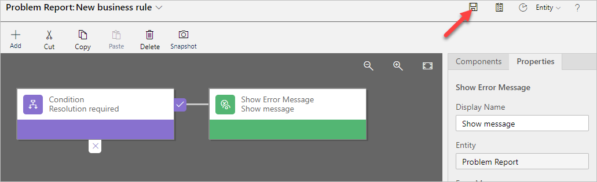

17. Click **Activate**.

18. Confirm activation.

19. Close the process editor browser window or tab.

20. Click **Done**.

### Exercise 3: Test processes

In this exercise, you will test the business process flow and the business rule you created.

#### Task 1: Test processes

1.  Navigate to the [Power Apps maker portal](https://make.powerapps.com/) page and make sure you are in the correct environment.

2.  Select **Apps** and click to open the **Company 311 Admin** application.

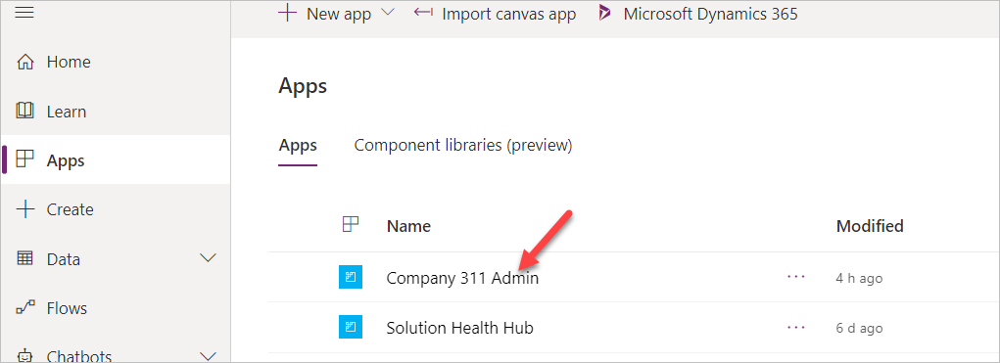

3.  Select **Problem Reports** and click **+ New**.

4.  You should see the business process flow stages. Enter **Dark parking lot** for **Title**, select **London Paddington** for **Building**, enter **There are no lights at the north end of the parking lot**, and click **Save**.

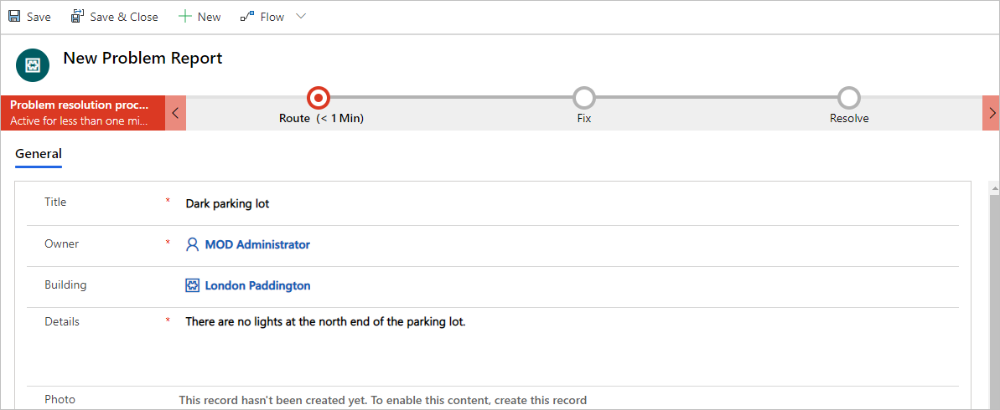

5.  Click on the **Route** stage.

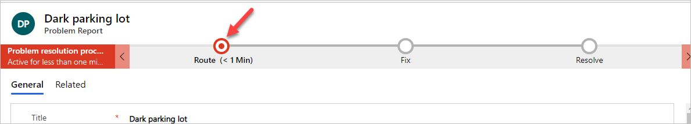

6.  Enter **North end** for **Location**, select **Facility Maintenance** for **Department**, and select the Fix stage.

7.  Select a user for **Assign to** and click on the **Resolve** stage.

8.  Select date and time for the **Resolved on** and leave the **Resolution** value empty.

9.  Scroll down to the resolution details section and select Completed for Status Reason. You should see the business rule error message.

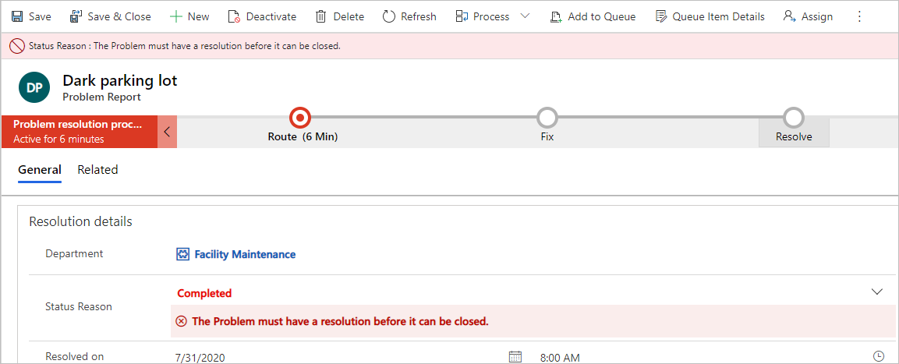

10. Provide Resolution. The error message should go away.

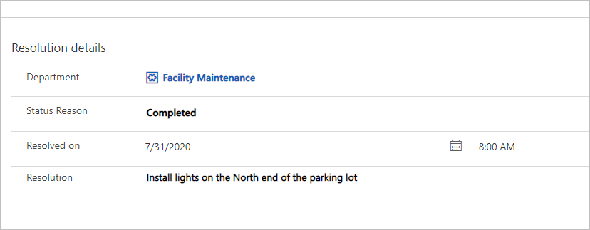

11. Save the record.
