# **Lab 05: Power Automate**

In this lab, you will create Power Automate flows to automate various parts of the Company 311 solution.

The following have been identified as requirements you must implement to complete the project: 

  - Escalation, approval, and execution process for urgent maintenance issues 

  - Notify reporting user about the issue status changes 

  - How to use a business rule to implement logic.

## **What you will learn**

  - How to design data fields to support automation 

  - How to build a flow using Common Data Service 

  - How to use approvals 

## **High-level lab steps**

  - Exercise 1 – add fields to support escalation 

  - Exercise 2 – build flow to approve escalation  

  - Exercise 3 – build flow to notify user of status change

## **Prerequisites**

  - Completion of Lab 01 - Data model and model-driven app

## Things to consider before you begin

  - What is the most efficient way to identify urgent maintenance issues and escalate them

## Detailed steps  

### **Exercise 1: Build notify flow**

In this exercise, you create a flow that will notify the creator of a problem when the status changes.

#### **Task 1: Create flow**

In this task, you will create a flow that send notification when the status of problem report record changes.

1.  Navigate to the [Power Apps maker portal](https://make.powerapps.com/) and make sure you are in the correct environment.

2.  Select **Solutions** and click to open the **Company 311** solution.

3.  Click **+ New** and select **Flow**.

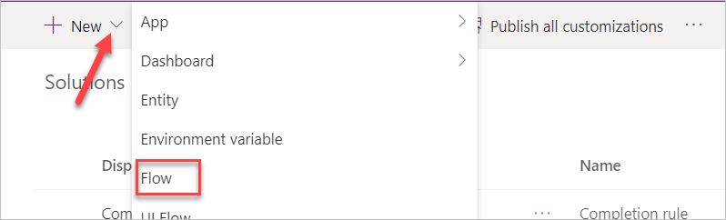

4.  Search for **when a record is created** and select **When a record is created, updated, or deleted** **Common Data Service (Current Environment)**

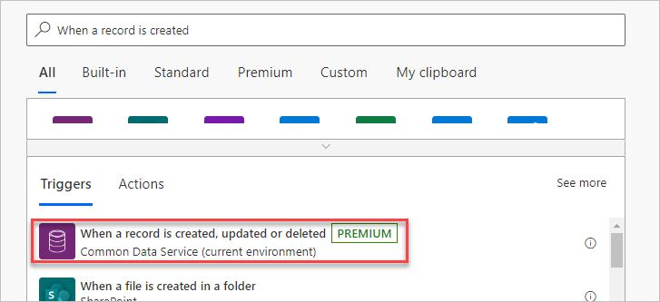

5.  Select **Update** for **Trigger condition**, **Problem Reports** for **Entity name**, **Organization** for **Scope**, and click **Show advanced options**.

6.  Enter **statuscode** for **Filtering attributes** and **… Menu** button of the trigger step.

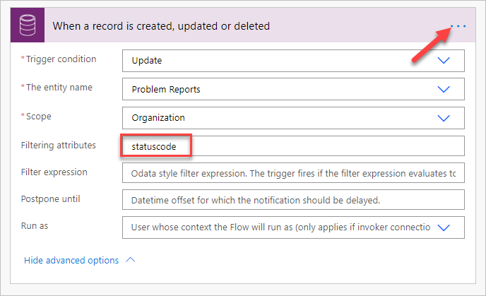

7.  Select **Rename**.

8.  Rename the trigger step **When problem report status changes**.

9.  Click **+ New step**.

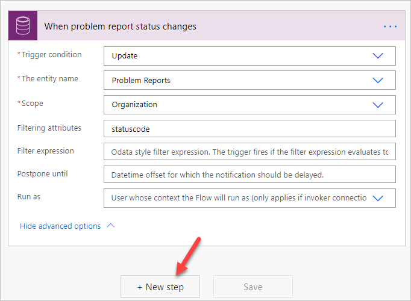

10. Search for **get a record** and select **Get a record Common Data Service (Current environment)**.

11. Select **Users** for **Entity name**.

12. Click on the **Item ID** field, go to the Dynamic pane, search for **created** and select **Created By (Value)**.

13. Click **Show advanced options** of the new step.

14. Enter **internalemailaddress** for **Select Query**.

15. Click on the **… Menu** button of the new step and select **Rename**.

16. Rename the step **Get problem creator**.

17. Click **+ New step**.

18. Search for **send email** and select **Send an email (V2).**

19. Click to select the **To** field and click **Switch to advanced mode**. Click on this button toggles show/hide of the dynamic pane.

20. Select the **Primary Email** field form the **Get problem creator** step.

21. Enter **Problem report status change notification** for **Subject**.

22. Click to select the **Body** field.

23. Type **The status of the problem you reported has changed.** and press the **\[ENTER\]** key.

24. Type **Problem Title:** go to the Dynamic pane, search for **title** and select **Title**.

25. Press the **\[ENTER\]** key.

26. Type **Current Status:** go to the Dynamic pane, select the **Expression** tab, paste the expression below, and click OK. This expression will show the label of the option set instead of the value.

`triggerOutputs()?\['body/\_statuscode\_label'\]`

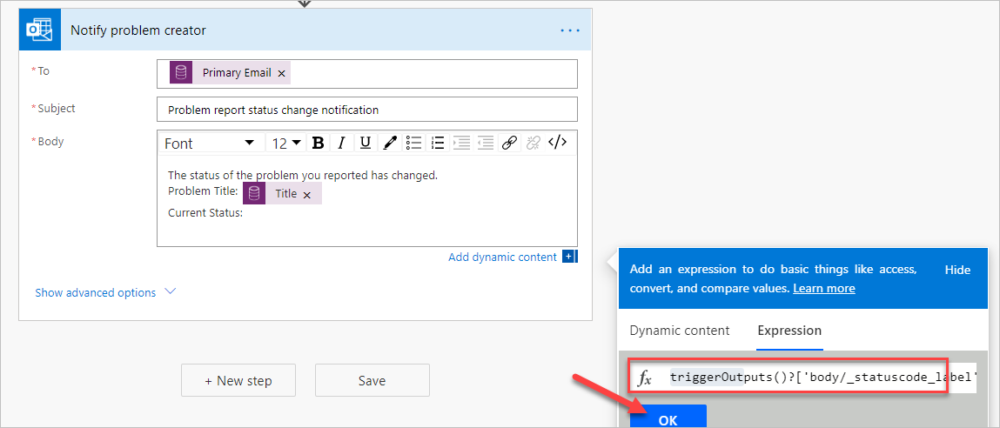

27. Click on the **… Menu** button of the new step and select **Rename**.

28. Rename the **Notify problem creator**.

29. The step should now look like the image below.

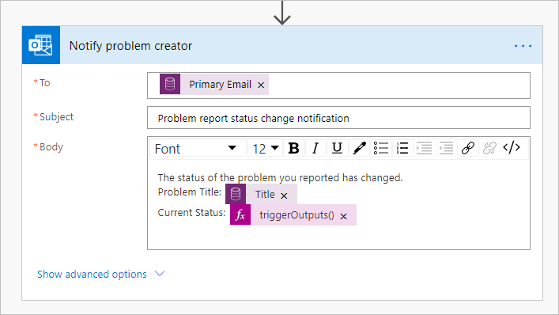

30. Scroll up change the flow name from Untitled to **Notify Problem Creator.**

31. Click **Save** to save the flow.

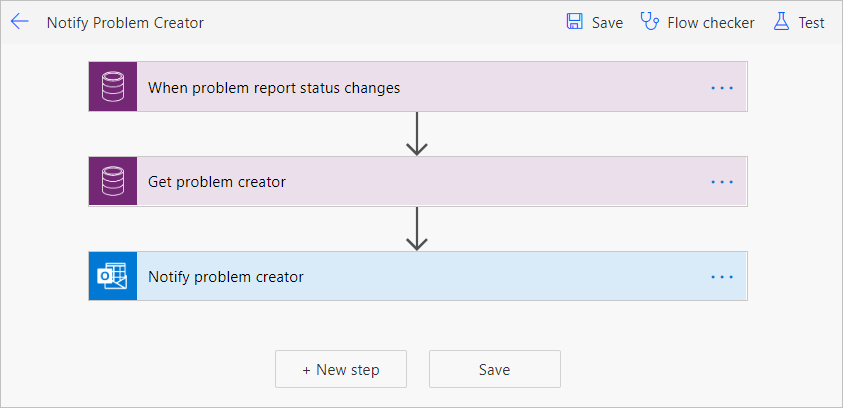

32. Close the flow designer browser window or tab.

33. Clock **Done** on the popup window.

34. Do not navigate away from this page.

#### **Task 2: Test the flow**

In this task, you will test the notify problem creator flow.

1.  Make sure you are still on the [Power Apps maker portal](https://make.powerapps.com/) site and you are in the correct environment.

2.  Select **Apps** and click to open the **Company 311 Admin** application.

3.  Click **+ New**.

4.  Enter **Flow test** for **Title**, select **London Paddington** for **building**, enter **This is a flow test record** for **Details**, and click **Save**.

5.  Scroll down and change the **Status Reason** value to **In Progress** and save again.

6.  Close the application browser window or tab.

7.  You should now be back to the [Power Apps maker portal](https://make.powerapps.com/)

8.  Select **Solutions** and click to open the **Company 311** solution.

9.  Locate and click to open the **Notify Problem Creator** flow you created.

10. You should see a succeeded flow run. Click to open the run.

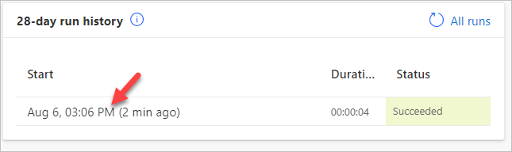

11. All the flow steps should have a green check mark.

12. Click **App launcher** and select **Outlook**.

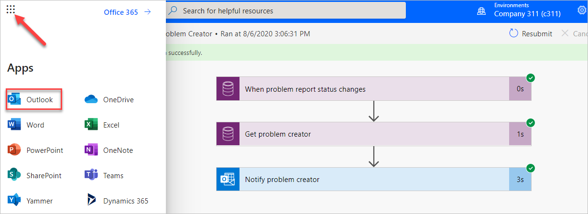

13. You should get an email from the flow. Click to open the email.

14. The email should look like the image below.

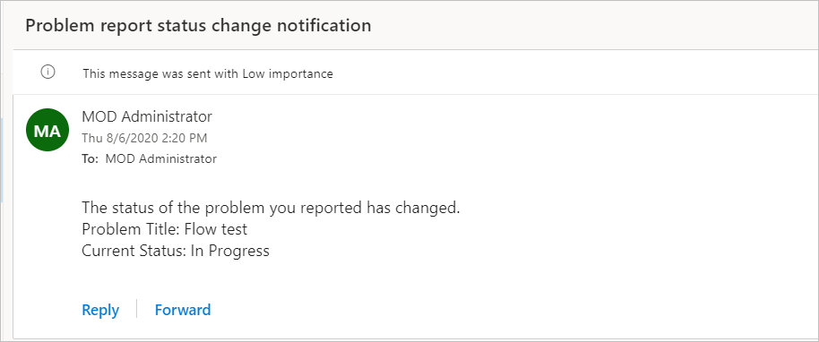

### **Exercise 2: Build escalation flow**

In this exercise, you create add two new fields to the problem report entity and create escalation flow.

#### **Task 1: Add fields**

In this task, you add a new fields to the problem report entity.

1.  Navigate to the [Power Apps maker portal](https://make.powerapps.com/) and make sure you are in the correct environment.

2.  Select **Solutions** and click to open the **Company 311** solution.

3.  Locate and click to open the **Problem Report** entity.

4.  Make sure you have the **Fields** tab selected and click **+ Add field**.

5.  Enter **Estimated Cost** for **Display name**, select **Currency** for **Data type**, and click **Done**.

6.  Click the **Save Entity** located on bottom right of the screen.

7.  Select the **Forms** tab.

8.  Click to open the **Main** form.

9.  Add **Estimated Cost** field to the form and place it below the **Status Reason** field.

10. Add the **Assign to** field and place it below the **Estimated Cost** field.

11. The **Resolution details** section of the form should now look like the image below. Click **Save**.

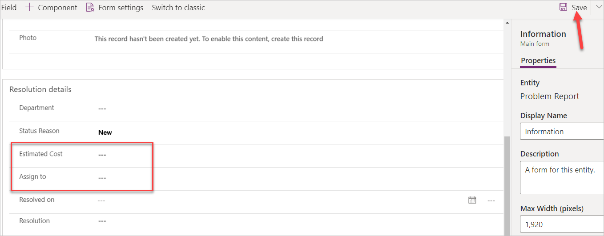

12. Click on the **Back** button located on the top left of the screen.

13. Select **Solution**, click **Publish all customizations**, and wait for the publishing to complete.

#### **Task 2: Build escalation flow**

In this task, you will create the escalation flow.

1.  Navigate to the [Power Apps maker portal](https://make.powerapps.com/) and make sure you are in the correct environment.

2.  Select **Solutions** and click to open the **Company 311** solution.

3.  Click **+ New** and select **Flow**.

4.  Search for **when a record is created** and select **When a record is created, updated, or deleted Common Data Service (Current environment)**.

5.  Select **Create or Update** for **Trigger condition**, select **Problem Reports** for **Entity name**, select **Organization** for **Scope**, and click **Show advanced options**.

6.  Enter **lh\_estimatedcost** for Filtering attribute and click **Hide advanced options**.

7.  Click on the **… Menu** button of the trigger step and select **Rename**.

8.  Rename the trigger step **When a problem report is created or updated**.

9.  Click **+ New step**.

10. Select **Condition** control.

11. Click to select the first **Choose a value** field.

12. Go to the Dynamic content pane, search for estimated and select Estimated Cost

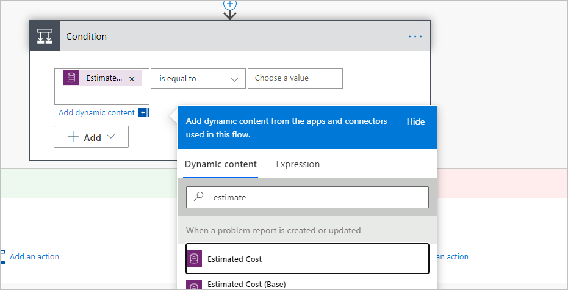

13. Select **is greater than** and end enter **1000**.

14. Rename the condition step **Check if cost is greater than 1000**.

15. Go to the **If yes** branch and click **Add an action**.

16. Search for **get a record** and select **Get a record Common Data Service (Current environment)**.

17. Select **Users** for **Entity name**.

18. Click to select the **Item ID** field and select **Assign to (Value)** form the **Dynamic content** pane.

19. Click **Show advanced options**.

20. Enter **internalemailaddress** for **Select Query**.

21. Click **Hide advanced option**.

22. Rename the **Get a record** step **Get user**.

23. Click **Add and action**.

24. Search for **approval** and select **Start and wait for an approval**.

25. Select **Approve/Reject - Everyone must approve** for **Approval type**.

26. Enter **Cost approval required** for **Title**.

27. Click to select the Assigned to filed.

28. Go to the **Dynamic content** pane and select **Primary Email** from the **Get user** step.

29. Paste the markdown text below in the **Details** field.

> \#\# URGENT Approval Required
>
> This is \*\*very\*\* expensive item with the estimated cost of

30. Place your cursor after cost of , go to the Dynamic content pave, select the Expression tab, paste the expression below, and click OK.

`formatNumber(triggerOutputs()?\['body/lh\_estimatedcost'\], 'C2')`

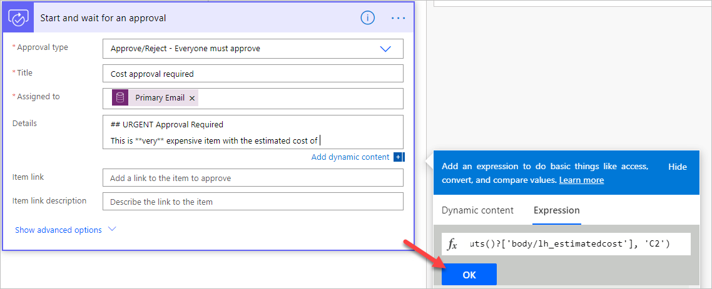

31. Click **Add an action**.

32. Select **Condition** control.

33. Click to select the first **Choose a value** field.

34. Go to the **Dynamic content** pane, search for **outcome,** and select **Outcome**.

35. Select is **equals to** and type **Reject** for value.

36. Go to the **If yes** branch and click **Add an action**.

37. Search for **update a record** and select **Update a record** **Common Data Service (Current environment)**.

38. Select Problem Reports for Entity name.

39. Click to select the **Item ID** field.

40. Go to the **Dynamic content** pane, search for **problem report,** and select **Problem Report**.

41. Click **Show advanced options**.

42. Click to select the **Resolution** filed, go to the **Dynamic content** pane, and select **Response summary**.

43. Select **Won’t fix** for **Status Reason**.

44. Rename the step **Update problem report**.

45. Scroll up and rename the flow **Escalate Expense Approval**.

46. Click **Save**.

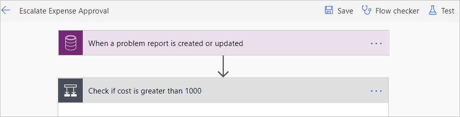

47. Close the flow designer browser window or tab.

48. Click **Done** on the popup.

#### **Task 3: Test flow**

In this task, you will test the escalation flow

1.  Navigate to the [Power Apps maker portal](https://make.powerapps.com/) and make sure you are in the correct environment.

2.  Select **Apps** and click to open the **Company 311 Admin** application.

3.  Click to open on of the **Problem Report** records.

4.  Scroll down, enter 2500 for Estimated Cost, assign it to yourself (for test purposes), and click Save.

5.  Navigate to [Power Automate](https://us.flow.microsoft.com/en-us/)

6.  Expand **Action Items** and select **Approvals**.

7.  You should see at least one approval in the received tab. Click to open the approval. It can take a few minutes for approvals to show up here on the first run.

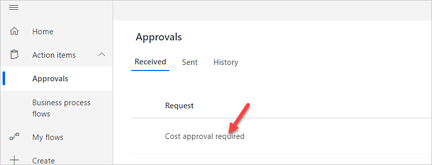

8.  Select **Reject**, enter **We don't have the funds for this item** for **comment**, and click **Confirm**.

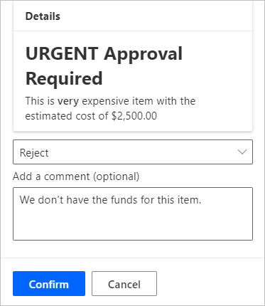

9.  Go back to the **Company 311 Admin** application.

10. Change the view to **My Reports** and click to open the same record you change the estimated cost.

11. The **Status Reason** should be set to **Won’t fix** and the **Resolution** should match the comment you provided.

## **Discussion**

  - Would creating a bool field for Approved/Rejected be better?

## **Bonus exercises**

  - Add ability for the users to subscribe to the reported problems and only notify if there is a subscription. 

  - Auto-subscribe creator of the problem report.

  - How to find out previous value of status reason?
