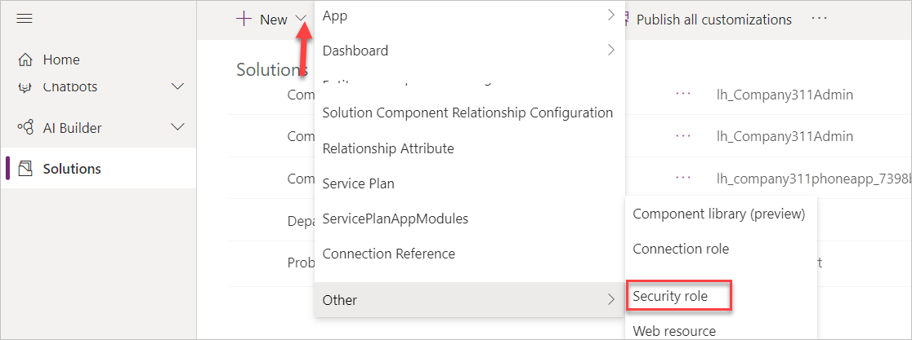
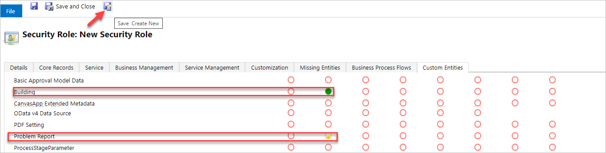
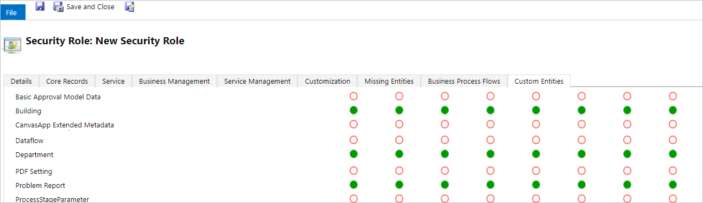
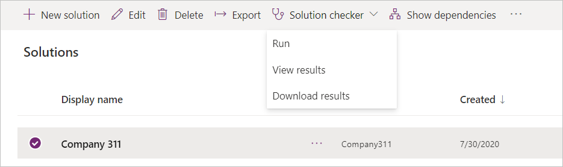
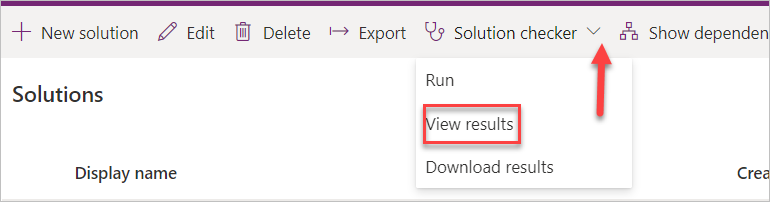
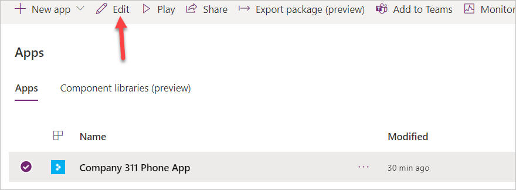
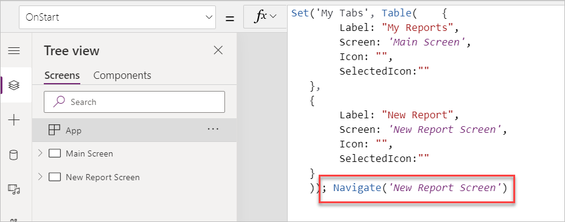
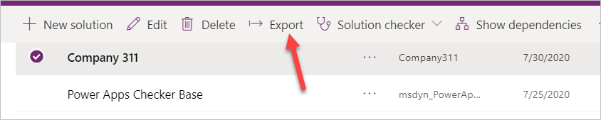
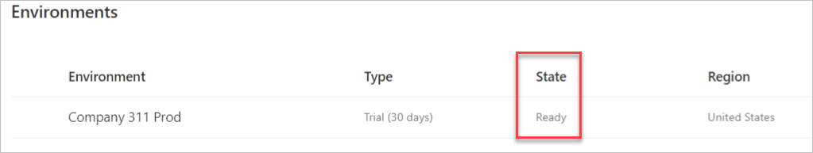

---
lab:
    title: 'Lab: Test & Deploy'
    module: 'Module 8: Testing & deployment'
---

> [!NOTE]
> Effective November 2020:
> - Common Data Service has been renamed to Microsoft Dataverse. [Learn more](https://aka.ms/PAuAppBlog)
> - Some terminology in Microsoft Dataverse has been updated. For example, *entity* is now *table* and *field* is now *column*. [Learn more](https://go.microsoft.com/fwlink/?linkid=2147247)
>
> This content will be updated soon to reflect the latest terminology.

# Lab 07: Test & Deploy

In this lab you will complete solution configuration by adding security roles for the users. Then you will verify, test, and deploy your solution in the production environment.

## What you will learn

  - How to deploy a solution to another environment

## High-level lab steps

  - Exercise 1 – Create security roles for users 
    
      - Company 311 User – read all on Building, user own on problem reports 
      
      - Company 311 Admin – All for Buildings, Departments, Problem reports 
      
      - Associate Company 311 Admin role with model-driven app 

  - Exercise 2 – Run solution checker

  - Exercise 3 – Use Test Studio to create Test case for submitting problem (ok to not include image)

  - Exercise 4 – Export and import solution 

## Prerequisites

* Must have completed **Lab 02: Data model and model-driven app**

## Detailed steps

### Exercise 1: Create security roles

In this exercise, you create security roles for users.

#### Task 1: Create security roles

1.  Navigate to the [Power Apps maker portal](https://make.powerapps.com/) and make sure you are in the correct environment.

2.  Select **Solutions** and click to open the **Company 311** solution.

3.  Click **+ New** and select **Other | Security Role**.

4.  Enter **Company 311 User** for **Role Name** and select the **Custom Entities** tab.

5.  Set the read privilege of the **Building** entity to **Organization**.

6.  Set the read privilege of the **Problem Report** entity to **User**.

7.  The read privileges for the **Building** and **Problem Report** entities should now look like the image below. Click **Save Create New**.

8.  Enter **Company 311 Admin** for **Role Name** and select the **Custom Entities** tab

9.  Set all privilege of the **Building**, **Department**, and **Problem Reports** entities to **Organization**.

10. Select the **Customizations** tab.

11. Associate **Model-driven app** with the **Company 311 Admin** role.

12. Click **Save and Close**.

13. Click **Done** on the popup.

14. Select **Solutions**.

15. Click **Publish all customizations** and wait for the publishing to complete.

### Exercise 2: Solution checker

In this exercise, you will run the solution checker on the Company 311 solution.

#### Task 1: Run solutions checker

1.  Make sure you are still on the [Power Apps maker portal](https://make.powerapps.com/) site and you are in the correct environment.

2.  Select **Solutions**, click **Solution checker**, and select **Run**.

3.  The solution checker should start checking your solution, wait for the it to complete. The solution check column value will change to Results with a timestamp.

4.  Select the solution again, click **Solution checker**, and select **View results**.

5.  Review the solution check results and make sure there are no issues.

### Exercise 3: Use test studio

In this exercise, you create use test studio to create test case for submitting a problem report.

#### Task 1: Create test case

1.  Navigate to the [Power Apps maker portal](https://make.powerapps.com/) and make sure you are in the correct environment.

2.  Select **Apps**, select the **Company 311 Phone** application, and click **Edit**.

3.  Click **File** and select **Settings**.

4.  Select **Advanced settings**.

5.  Scroll down and enable **Formula level error management**.

6.  Click on the back button to go back to the app designer.
    
    Note: Currently test studio cannot record steps inside components like the tab control we are using, you edit the App OnStart formula, so the app navigates directly to the new report screen.

7.  Select the **Tree view** tab.

8.  Select App and add the formula below to the existing formula.

; Navigate('New Report Screen')

9.  Click **File** and select **Save**.

10. Click **Publish**.

11. Select **Publish this version** and wait for the publishing to complete.

12. Click on the back button to go back to the app designer.

13. Select the **Advanced tools** tab and select **Open tests**.

14. Click on the **…** button of the **Case** and select **Rename**.

15. Rename the Case to **Submit problem report**.

16. Click **Record**.

17. Select the **New Report** tab.

18. Fill out the form and click **Submit**.

19. Click **Done**.

20. You should see list of the recorded steps.

21. Click **Play**.

22. Click **Publish** and wait for the publishing to complete.

23. The steps should replay correctly. Click **Done**.

24. Close the test studio browser window or tab.

25. Close the app designer browser window or tab.

26. Click Done on the popup.

### Exercise 4: Import export

In this exercise, you will export the company 311 solution and import it into a new environment.

#### Task 1: Export solution

1.  Navigate to the [Power Apps maker portal](https://make.powerapps.com/) and make sure you are in the correct environment.

2.  Select **Solutions**, select the **Company 311** solution, and click **Export**.

3.  Click **Next**.

4.  Select **Managed** and click **Export**.

5.  Save the solution on your computer.

6.  Click **Export** again.

7.  Click **Next**.

8.  Select **Unmanaged**, change the version to match the managed solution version, and click **Export**.

9.  You should have the managed and unmanaged versions of the solution exported.

#### Task 2: Create new environment and import solution

1.  Navigate to the [Power Apps admin portal](http://aka.ms/ppac)

2.  Select environments and click **+ New**.

3.  Enter **Company 311 Prod** for **Name**, select **Trial** (**not** subscription based), select **Yes** for **Create database for this environment**, and click **Next**.

4.  Select your **Language**, select your **Currency**, and click **Save**.

5.  Wait for the environment and database to be created, The State will change to **Ready** when ready. Click on the Refresh button to see the status.

6.  Select **Solutions**, select the **Company 311** solution, and click **Export**.

7.  Navigate to the [Power Apps maker portal](https://make.powerapps.com/) and select the environment you just created.

8.  Select **Solutions** and click **Import**.

9.  Click **Choose File**.

10. Select the managed solution you exported and click **Open**.

11. Click **Next**.

12. Click **Next** again.

13. Click **Import** and wait for the import to complete.

14. Click **Publish all customizations** and wait for the publishing to complete.

15. Click **Close** to close the import solution wizard.

16. Click to open the **Company 311** solution you just imported.

17. Review the components in solution.

18. Select **Apps** and make sure you have both the Canvas and Model-driven applications.

19. Click to open the **Company 311 Admin** application.

20. The application should load without issues.

21. Close the Company 311 Admin application browser window or tab.

22. Click To open the **Company 311 Phone App**.

23. The application should load without issues.

24. Close the **Company 311 Phone App** browser window or tab.
