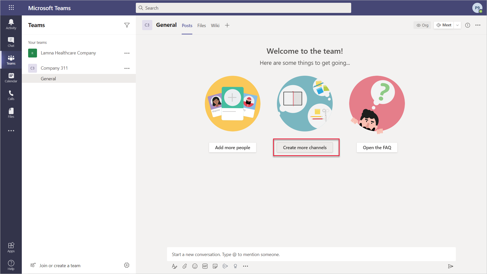
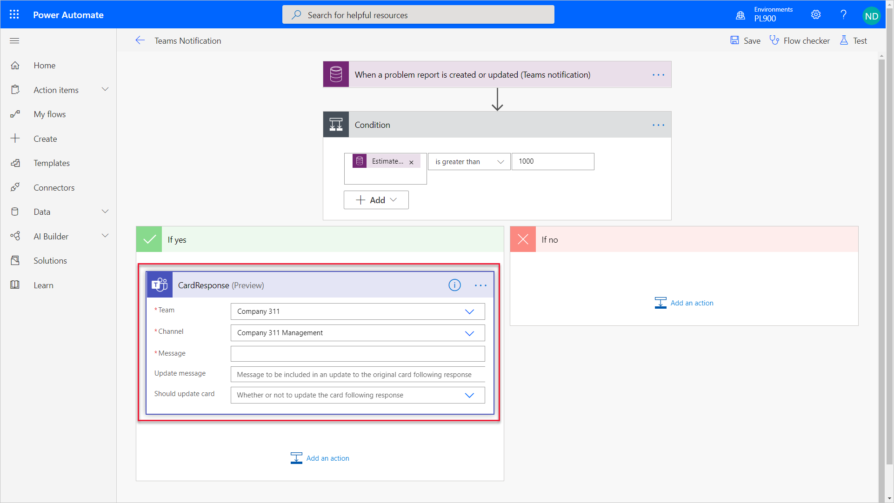
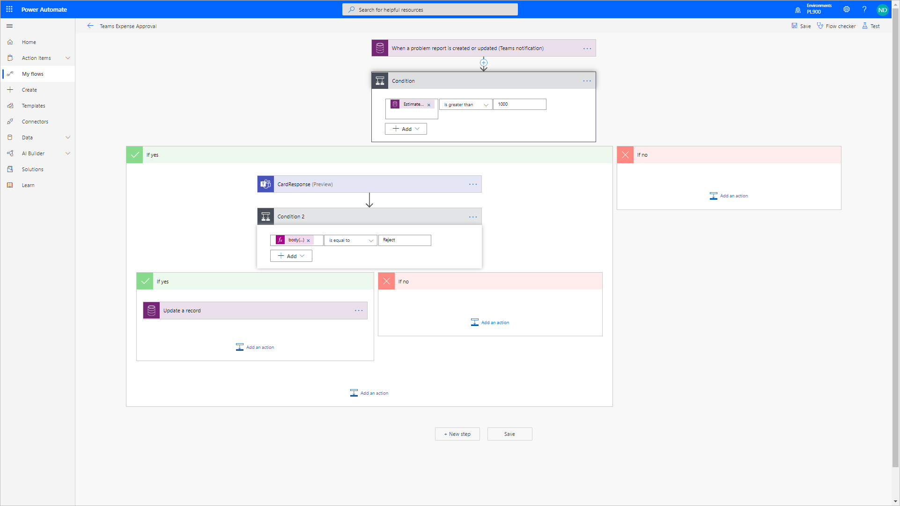
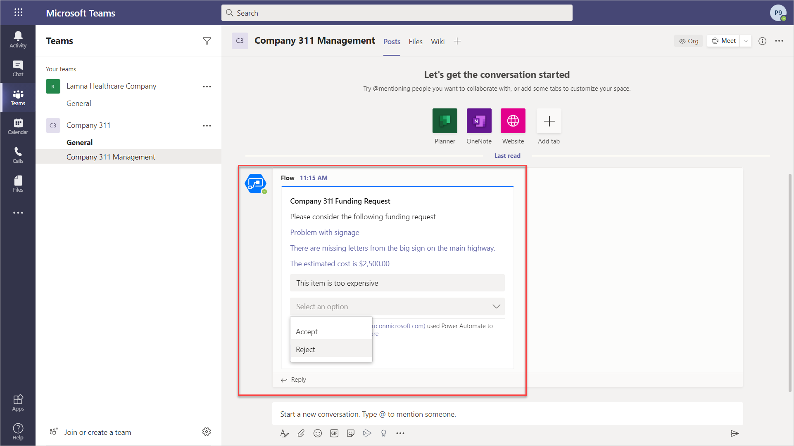
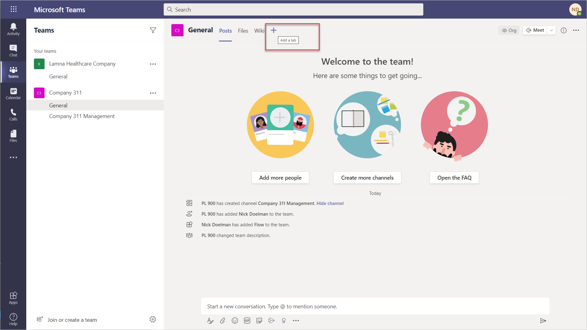
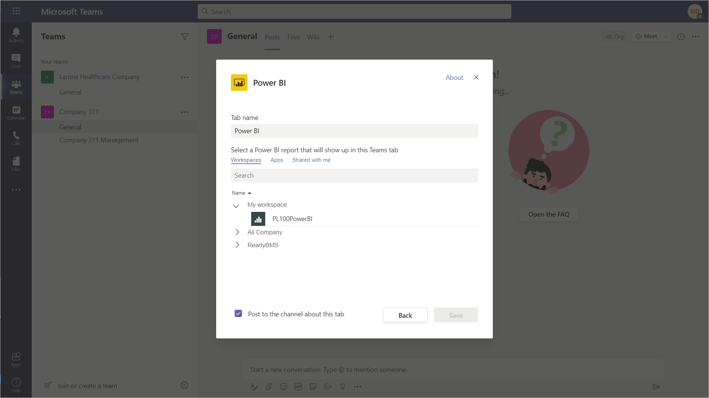
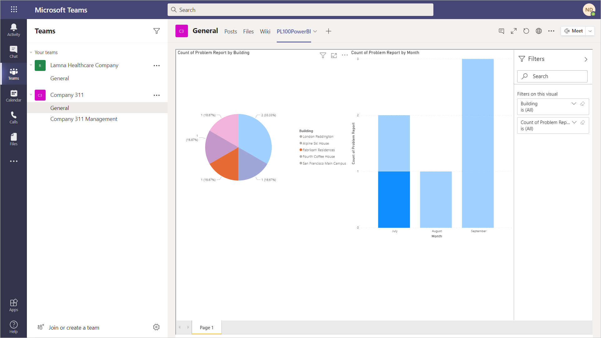
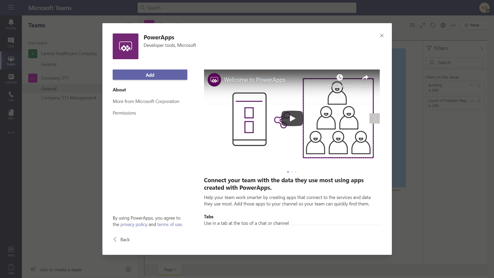

---
lab:
    title: 'Lab: Teams Integration'
    module: ''
---

# Lab 0x: Microsoft Teams Integration

In this lab, you will create Power Automate flows to automate various parts of the Company 311 solution by integrating with Micrsoft Teams.  You will also integrate the Company 311 canvas app and Power BI report into Microsoft Teams

The following have been identified as requirements you must implement to complete the project: 

  - Escalation, approval, and execution process for urgent maintenance issues will need to be displayed in a Microsoft Teams channel 

  - The Company 311 problem reporting app will need to embedded in Microsoft Teams

  - The Company 311 Power BI report will need to be embedded in Microsoft Teams

## What you will learn

  - How to implement adaptive cards in Microsoft Teams

  - How to add an existing canvas Power App and existing Power BI report into Microsoft Teams


## High-level lab steps

  - Exercise 1 – Build a flow to display adapative cards for problem escalations

  - Exercise 2 – embed the Company 311 Power BI report to Microsoft Teams

  - Exercise 3 – embed the Company 311 phone app to Microsoft Teams

## Prerequisites

* Must have completed **Lab 02: Data model and model-driven app**
* Must have completed **Lab 03: Canvas Apps**
* Must have completed **Lab 04: Business Process Flows and Business Rules**
* Must have completed **Lab 05: Power Automate**
* Must have completed **Lab 06: Power BI**

## Things to consider before you begin

  - The world has changed rapidly in the recent months and organizations need tools to work collaboratively yet remotely.  Microsoft Teams provides a powerful platform for collaboration and communication, and also provides an app maker with additional options when deploying apps and building business processes.  Consider ways some of your business apps and processes could be elevated by integrating with Microsoft Teams.

## Detailed steps  

### Exercise 1: Build problem escalation flow to show adaptive card in Microsoft Teams

In this exercise, you will setup a team in Microsoft Teams dedicated to the Company 311 applications and also create a similiar cost approval flow that you created in Lab 5.  However the approval request will appear as an adaptive card in a manager team channel as opposed to an approval message.

* Task 1: Setup Manager Channel in Teams
* Task 2: Build Flow with adaptive card
* Task 3: Test adaptive card

#### Task 1: Setup Manager Channel in Teams

In this task you will setup a Microsoft Teams team for the Lamna Healthcare Company.

1.  Navigate to [Microsoft Teams](https://teams.microsoft.com) and login with the same credentials you have been using for the other labs.

2.  Select **Use the web app instead** on the welcome screen.


3.  When the Microsoft Teams window opens, dismiss the welcome messages.

4.  On the bottom left corner, choose **Join or create a team**

5.  Select **Create a team**


6.  Press **Build a team from scratch**

7.  Select **Public**

8.  For the Team name choose **Company 311** and select **Create**

9.  Select **Skip** adding members to Company 311.

10. Select the **Company 311** team and press **Create more channels** from the main page.



11. Enter in **Company 311 Management** and for privacy leave default as **Standard - Accessible to everyone on the team** and press **Add**

> ![NOTE] 
> It would be typical to create a manager channel with privary set as **Private** however there is currently a limitation on using Adaptive Cards on private channels in Microsoft Teams.

12. Your Microsoft Teams page should look something like the following;


#### Task 2: Build escalation flow to display adaptive card in Teams channel

In this task, you will create the escalation flow.

1.  Navigate to the [Power Apps maker portal](https://make.powerapps.com/) and make sure you are in the correct environment.

2.  Select **Solutions** and click to open the **Company 311** solution.

3.  Click **+ New** and select **Flow**.

4.  Search for **when a record is created** and select **When a record is created, updated, or deleted Common Data Service (Current environment)**.

5.  Select **Create or Update** for **Trigger condition**, select **Problem Reports** for **Entity name**, select **Organization** for **Scope**, and click **Show advanced options**.

6.  Enter **lh\_estimatedcost** for Filtering attribute and click **Hide advanced options**.

7.  Click on the **… Menu** button of the trigger step and select **Rename**.

8.  Rename the trigger step **When a problem report is created or updated (Teams notification)**.

9.  Click **+ New step**.

10. Select **Condition** control.

11. Click to select the first **Choose a value** field.

12. Go to the Dynamic content pane, search for estimated and select Estimated Cost


13. Select **is greater than** and end enter **1000**.

14. Rename the condition step **Check if cost is greater than 1000**.

15. Go to the **If yes** branch and click **Add an action**.

16. Search for **Teams** and select **Post an Adaptive Card to a Teams channel and wait for a response (Preview)**.

17. Click on the **… Menu** button of the action step and select **Rename**.

18. Rename the action step to **CardResponse**.

19. Select **Company 311** for the Team and **Company 311 Management** for the Channel.



20. Cut and paste the following JSON code into the Message area.  This JSON code represents the Adaptive Card and was created using the [Adaptive Cards Designer](https://adaptivecards.io/designer/)

```JSON
{
    "type": "AdaptiveCard",
    "$schema": "http://adaptivecards.io/schemas/adaptive-card.json",
    "version": "1.1",
    "body": [
        {
            "type": "TextBlock",
            "text": "Company 311 Funding Request",
            "id": "id_title",
            "size": "Medium",
            "weight": "Bolder",
            "color": "Dark"
        },
        {
            "type": "TextBlock",
            "text": "Please consider the following funding request",
            "id": "id_request"
        },
        {
            "type": "TextBlock",
            "text": "{{replace with problem report title}}",
            "id": "id_requesttitle",
            "color": "Accent"
        },
        {
            "type": "TextBlock",
            "text": "{{replace with problem report detail}}",
            "id": "id_detail",
            "color": "Accent"
        },
        {
            "type": "TextBlock",
            "text": "The estimated cost is {{expression showing the cost}}",
            "id": "id_cost",
            "color": "Accent"
        },
        {
            "type": "Input.Text",
            "placeholder": "Please enter feedback about the issue",
            "id": "id_reason"
        },
        {
            "type": "Input.ChoiceSet",
            "choices": [
                {
                    "title": "Accept",
                    "value": "Accept"
                },
                {
                    "title": "Reject",
                    "value": "Reject"
                }
            ],
            "placeholder": "Please provide approval response",
            "id": "id_choices"
        }
    ],
    "actions": [
        {
            "type": "Action.Submit",
            "title": "Submit",
            "id": "btnSubmit"
        }
    ]
}
```

21. Modify the JSON code in the Message box by using the Dynamic content window and replace {{replace with problem report title}} with the **Title** field from the trigger action.

22. Modify the JSON code in the Message box and replace {{replace with problem report detail}} with **Details** from the trigger action.

23. Modify the JSON code in the Message box and replace {{expression showing the cost}} with the following **Expression** formula;

`formatNumber(triggerOutputs()?['body/lh_estimatedcost'], 'C2')`

24. The code should look something like this;


25. Enter in **Thank You** for the Update message.

26. Choose **Yes** for Should update card.

27. Click **Add an action**

28. Select **Condition** control.

29. Click to select the first **Choose a value** field.

30. Enter in the following Expression

`outputs('CardResponse').body.data.id_choices`

> ![NOTE]
> At this time there is an issue with adding Dynamic content from a Teams action, so we use the **outputs()** function to gather the results from the Teams card action.

31. Select **is equal to** and end enter **Reject**.


32. Go to the **If yes** branch and click **Add an action**.

33. Search for **update a record** and select **Update a record** **Common Data Service (Current environment)**.

34. Select Problem Reports for Entity name.

35. Click to select the **Item ID** field.

36. Go to the **Dynamic content** pane, search for **problem report,** and select **Problem Report**.

37. Click **Show advanced options**.

38. Click to select the **Resolution** field, go to the **Expression** pane, and enter the following formula;

`outputs('CardResponse').body.data.id_reason`

39. Select **Won’t fix** for **Status Reason**.

40. Rename the step **Update problem report**.

45. Scroll up and rename the flow **Teams Expense Approval**.

46. Click **Save**.



47. Close the flow designer browser window or tab.

48. Click **Done** on the popup.

#### Task 3: Test flow

In this task, you will test the escalation flow

1.  Navigate to the [Power Apps maker portal](https://make.powerapps.com/) and make sure you are in the correct environment.

2.  Select **Apps** and click to open the **Company 311 Admin** application.

3.  Click to open on of the **Problem Report** records.

4.  Scroll down, enter **2500** for **Estimated Cost**, assign it to yourself (for test purposes), and click **Save**.

5.  Navigate to [Microsoft Teams](https://teams.microsoft.com)

6.  In the **Company 311** team, select the **Company 311 Management** channel.

7.  You should see the Company 311 Funding Request Adaptive Card.  

8.  Enter **This item is too expense** in the feedback area and select **Reject** from the options.



9.  Select **Submit**.  You should then see a Thank You message.

10.  Go back to the **Company 311 Admin** application.

10. Change the view to **My Reports** and click to open the same record you change the estimated cost.

11. The **Status Reason** should be set to **Won’t fix** and the **Resolution** should match the comment you provided.


### Exercise 2: Embed a Power BI Report in Microsoft Teams

In this exercise, you will add the Company 311 Power BI report in Microsoft Teams as a way for management and staff to be able to view the reports from directly within Teams.

#### Task 1: Add Power BI to Teams

1.  Navigate to [Microsoft Teams](https://teams.microsoft.com)

2.  Select the **General** channel of the **Company 311** team.

3.  On the top of the page, press the **+** symbol to add a new tab.



4.  Search for **power** and select **Power BI** from the results.

5.  Expand **My workspace** and select the report you created in Lab 06.



6.  Click **Save**  You should now see your Power BI report in a tab in Microsoft Teams



### Exercise 3: Embed the Company 311 Phone App in Microsoft Teams

In this exercise, you will add the Company 311 Phone App that you created in lab 3 to Microsoft Teams as a way for staff to be able to log issues directly within Teams.

Task 1: Setup Manager Channel in Teams
Task 2: 

#### Task 1: Add Power Apps to Teams

1.  Navigate to [Microsoft Teams](https://teams.microsoft.com)

2.  Select the **General** channel of the **Company 311** team.

3.  On the top of the page, press the **+** symbol to add a new tab.


4.  Search for **power** and select **PowerApps** from the results.

5.  Press **Add** to add Power Apps to Teams



6.  Select the **Company 311 Phone App** that you created in Lab 03.  (You may have to go back to the app editor and publish the app)

7.  Press **Save**

8.  The **Company 311** app should now appear on a tab in Microsoft Teams.


## **Discussion**

  - What are the pros and cons of using Microsoft Teams over regular email?

## **Bonus exercises**

  - Update the Power Automate flow to show if the request has been accepted back to the Teams channel

  - Create your own adaptive card using [Adaptive Cards Designer](https://adaptivecards.io/designer/)
